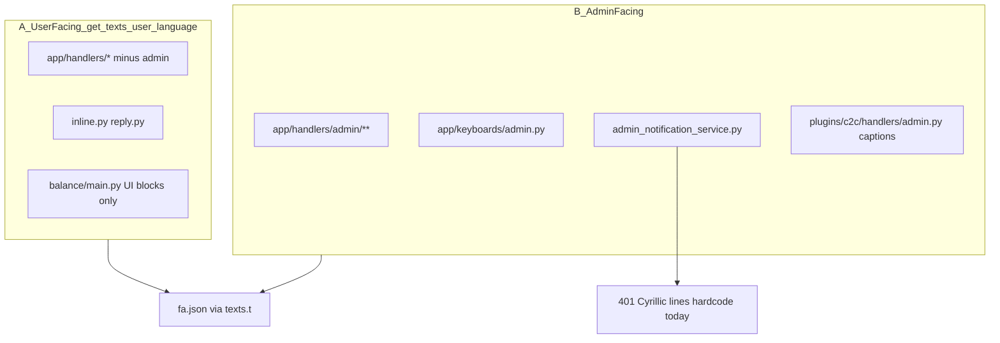

# پلن اجرایی fa-i18n (RemnaWave Telegram Bot)

## 1. Executive summary

- **وضعیت git:** روی `main` هستیم؛ `fa-i18n` **۰ commit جلوتر، ۲۲ commit عقب‌تر** از `main` است (merge-base = `f9eee0e1`). تمام commitهای قبلی fa-i18n **قبلاً در ancestry `main`** هستند؛ C2C، fix قالب `SUBSCRIPTION_OVERVIEW_*` و کلیدهای C2C **فقط روی `main`** آمده‌اند. **قبل از هر commit جدید:** `git checkout fa-i18n && git merge --ff-only main` (یا branch جدید `fa-i18n-v2` از `main`).
- **Locale:** `[app/localization/locales/fa.json](app/localization/locales/fa.json)` و mount `[./locales/fa.json](./locales/fa.json)` **هم‌سان** (192869 bytes، `diff` خالی). `ru`: 1798 کلید؛ `fa`: 2158 (+360 اضافه). **۰ کلید ru بدون fa** — تأیید شد.
- **کار باقی‌مانده:** اکثر مسیرهای پرکلیک از `texts.t(KEY, ru_fallback)` استفاده می‌کنند و fa.json فارسی دارد؛ **مشکل اصلی** pockets هاردکد روسی (gift deep-link در `start.py`، دکمه‌های `my_subscriptions.py`، خلاصه سفارش `pricing.py`، UI balance در `main.py`) + **۱۰ mismatch placeholder کاربر‌محور** با ریسک KeyError.
- **اولویت:** P0 = منو/اشتراک/خرید-tariff + balance UI فعال (C2C + support topup) + fix placeholder؛ P1 = devices/traffic/countries؛ P2 = admin panel + اعلان‌های گروه (تصمیم شما: **فارسی**).
- **تخمین:** ~**18–22 commit/PR** مستقل (یک handler/keyboard + fa.json در هر commit). miniapp/cabinet **فاز بعد** (خارج از scope).

---

## 2. فاز ۰ — یافته‌های کشف (تأیید/رد فرض‌ها)

### ۰.۱ Git و deploy


| فرض                                        | نتیجه                                                                                 |
| ------------------------------------------ | ------------------------------------------------------------------------------------- |
| Production = `remnabot/main` ≈ `dev-local` | `main` شامل mergeهای C2C و fix fa است؛ `dev-local` هم `main` را contain می‌کند        |
| `fa-i18n` عقب‌تر از `main`                 | **تأیید:** `22 0` (main-only commits)                                                 |
| `fa.json` mount sync                       | **تأیید:** فایل‌ها یکسان                                                              |
| `DEFAULT_LANGUAGE=fa`                      | **تأیید** در `[.env](.env)` L296                                                      |
| C2C روی main                               | **تأیید:** `C2C_ENABLED=true`؛ user handler از `texts.t` + کلیدهای `C2C_`* در fa.json |


**Branch strategy (توصیه):**

```bash
git checkout fa-i18n
git merge --ff-only main   # یا: git checkout -b fa-i18n-v2 main
```

### ۰.۲ نقشه «چه کسی چه می‌بیند»




**A) User-facing:** handlers غیر admin + keyboards + balance UI (نه wiring provider).

**B) Admin-facing:** `admin/`**, `[admin_notification_service.py](app/services/admin_notification_service.py)`, C2C admin captions.

**شاهد زبان ادمین:** `get_texts(db_user.language)` — **نه** `admin.language` ثابت، **نه** `'ru'` hardcode. مثال `[app/handlers/admin/main.py](app/handlers/admin/main.py)` L34. با `language=fa` کلیدهای fa.json resolve می‌شوند؛ اما ~6317 خط Cyrillic هاردکod/fallback و 14 ماژول admin بدون `get_texts` باقی مانده.

### ۰.۳ اسکن کمی


| ناحیه                            | فایل / occurrence Cyrillic (خط) | از `texts.t`؟                               | ریسک KeyError                                        |
| -------------------------------- | ------------------------------- | ------------------------------------------- | ---------------------------------------------------- |
| subscription/*                   | 14 فایل / ~2120                 | ~60–70% KEY+fallback؛ pockets هاردکod       | **متوسط** — `pricing.py`, fragments در `purchase.py` |
| start, menu, simple_subscription | 3 فایل / ~818                   | menu ~85% KEY؛ start gift block **هاردکod** | **پایین–متوسط**                                      |
| balance (UI only)                | 23 فایل / ~938                  | ~15% KEY؛ `main.py` هاردکod                 | **متوسط** در history/restriction                     |
| admin handlers                   | 39 فایل / ~6317                 | mixed؛ 14 فایل بدون get_texts               | **بالا** در admin-only keys                          |
| admin_notification_service       | 1 فایل / ~401                   | N/A hardcode                                | N/A                                                  |
| keyboards                        | 2 فایل / ~277                   | ~95% KEY                                    | **پایین** (1 دکمه + plural helpers)                  |


**تفکیک الگو:**

- **فقط fallback دوم `texts.t`:** اکثریت subscription/menu/keyboards — **نیاز به تغییر handler ندارد** اگر fa.json درست باشد.
- **مستقیم به کاربر:** `start.py` L165–214 (gift), `pricing.py` L212–232, `my_subscriptions.py` دکمه‌ها, `balance/main.py` L299+.

### ۰.۴ شکاف locale

- **ru بدون fa:** 0 ✓
- **placeholder ناسازگار (کل):** 35 — نمونه‌های خطرناک:
  - `CHANGE_DEVICES_CONFIRM`: ru `{action},{cost}` vs fa `{cost_text}` — **KeyError محتمل**
  - `BALANCE_BUTTON`: ru `{balance}` vs fa خالی
  - `SUBSCRIPTION_`* چند کلید: fa placeholders حذف شده
- **handler بدون KEY (نمونه):** `[start.py](app/handlers/start.py)` gift block؛ `[pricing.py](app/handlers/subscription/pricing.py)` headers؛ `[my_subscriptions.py](app/handlers/subscription/my_subscriptions.py)` 16× `text=`؛ `[balance/main.py](app/handlers/balance/main.py)` history/restriction/support blocks.

**کلیدهای fa موجود ولی handler هنوز روسی:** مثلاً `GIFT_ACTIVATED_SUCCESS` در fa.json هست ولی gift deep-link در start هنوز f-string روسی می‌فرستد.

### ۰.۵ جدول inventory (فاز ۰)


| ID    | سطح | مسیر/ماژول                                                                    | نمونه UX                                   | viewer | حجم | وابستگی                                                                                    |
| ----- | --- | ----------------------------------------------------------------------------- | ------------------------------------------ | ------ | --- | ------------------------------------------------------------------------------------------ |
| P0-01 | P0  | `[start.py](app/handlers/start.py)` gift deep-link                            | «Нельзя активировать свой подарок»         | user   | M   | keys: `GIFT_SELF_`*, `GIFT_ALREADY_*`, `GIFT_CANNOT_*`, `GIFT_ACTIVATED_*`, `GIFT_ERROR_*` |
| P0-02 | P0  | `[start.py](app/handlers/start.py)` language prompt                           | «Выберите язык»                            | user   | S   | `LANGUAGE_SELECT_PROMPT` (mirror ru)                                                       |
| P0-03 | P0  | `[subscription/pricing.py](app/handlers/subscription/pricing.py)`             | «Сводка заказа / Подтверждаете?»           | user   | M   | `SUBSCRIPTION_ORDER_SUMMARY_*`                                                             |
| P0-04 | P0  | `[my_subscriptions.py](app/handlers/subscription/my_subscriptions.py)`        | «Продлить / Устройства / Да, удалить»      | user   | M   | mirror `MY_SUB_*` / existing KEYs                                                          |
| P0-05 | P0  | `[purchase.py](app/handlers/subscription/purchase.py)` fragments              | «Суточный / осталось N дня»                | user   | L   | conflict risk upstream                                                                     |
| P0-06 | P0  | `[tariff_purchase.py](app/handlers/subscription/tariff_purchase.py)`          | «Подтвердить продление» buttons            | user   | L   | conflict risk                                                                              |
| P0-07 | P0  | `[balance/main.py](app/handlers/balance/main.py)`                             | «История операций / Пополнение ограничено» | user   | M   | C2C+SUPPORT_TOPUP فعال                                                                     |
| P0-08 | P0  | `[fa.json](app/localization/locales/fa.json)` placeholder fix                 | KeyError در devices/balance                | user   | M   | 10 user-facing mismatches                                                                  |
| P0-09 | P0  | `[keyboards/inline.py](app/keyboards/inline.py)` L1316                        | «Очистить корзину» duplicate               | user   | S   | `CLEAR_CART_AND_RETURN`                                                                    |
| P1-01 | P1  | `[devices.py](app/handlers/subscription/devices.py)`                          | «Нет серверов», plural days                | user   | M   | helper returns → KEY                                                                       |
| P1-02 | P1  | `[traffic.py](app/handlers/subscription/traffic.py)`                          | traffic topup UI                           | user   | M   | `TRAFFIC_TOPUP_ENABLED=true`                                                               |
| P1-03 | P1  | `[countries.py](app/handlers/subscription/countries.py)`                      | country picker labels                      | user   | M   | —                                                                                          |
| P1-04 | P1  | `[simple_subscription.py](app/handlers/simple_subscription.py)`               | residual Cyrillic (~395 hits)              | user   | M   | audit KEY-only leftovers                                                                   |
| P2-01 | P2  | `[admin/main.py](app/handlers/admin/main.py)` + submenus                      | «Выберите раздел» hardcode inject          | admin  | L   | `ADMIN_*` keys exist in fa                                                                 |
| P2-02 | P2  | admin hardcode-only (14 modules)                                              | `rules.py`, `servers.py`, …                | admin  | XL  | per-module commits                                                                         |
| P2-03 | P2  | `[admin_notification_service.py](app/services/admin_notification_service.py)` | «Новая покупка / C2C receipt»              | admin  | L   | **Option A selected** — block templates                                                    |
| P2-04 | P2  | `[keyboards/admin.py](app/keyboards/admin.py)`                                | admin buttons                              | admin  | M   | `get_texts(language)`                                                                      |
| P2-05 | P2  | `[autopay.py](app/handlers/subscription/autopay.py)`, contests                | جزئیات کم‌کاربرد                           | user   | S   | `CONTESTS_ENABLED=false` → optional                                                        |
| SKIP  | —   | balance providers disabled                                                    | CryptoBot, Heleket, WATA, Stars            | —      | —   | optional later                                                                             |
| SKIP  | —   | C2C user handlers                                                             | already `texts.t`                          | user   | —   | fa keys on main                                                                            |
| SKIP  | —   | menu.py KEY paths                                                             | fa.json covers                             | user   | —   | spot-check only                                                                            |


---

## 3. نقشه اولویت P0 → P2

**امتیازدهی:** فرکانس کلیک (×3) + ریسک runtime (×3) + مسیر درآمد (×2) + operational admin (×1) + عمق (×0.5).


| اولویت | اسلایس                                                            | دلیل                                          |
| ------ | ----------------------------------------------------------------- | --------------------------------------------- |
| **P0** | FF branch + placeholder fix (P0-08)                               | جلوگیری KeyError قبل از UX                    |
| **P0** | start gift + language (P0-01,02)                                  | هر registration/deep-link                     |
| **P0** | pricing + my_subscriptions + purchase/tariff fragments (P0-03–06) | مسیر خرید/تمدید/tariff                        |
| **P0** | balance/main UI (P0-07)                                           | C2C + support topup فعال؛ تنها روش topup عملی |
| **P1** | devices, traffic, countries, simple_subscription                  | post-purchase مدیریت                          |
| **P2** | admin handlers + admin notifications (A)                          | operational؛ admin با fa language             |
| **P2** | autopay/contests/disabled providers                               | کم‌کاربرد یا off                              |


---

## 4. جدول PR/commit پیشنهادی (~20)

هر ردیف = **یک commit** (`i18n(fa): …`) + smoke + `cp fa.json → locales/` + restart.


| #   | branch slug                            | فایل(ها)                              | کلیدهای fa پیشنهادی                                                                                                               | معیار done                         |
| --- | -------------------------------------- | ------------------------------------- | --------------------------------------------------------------------------------------------------------------------------------- | ---------------------------------- |
| 0   | `chore/fa-i18n-sync-main`              | git only                              | —                                                                                                                                 | `fa-i18n` FF با `main`             |
| 1   | `fa-i18n/fix-locale-placeholders`      | `fa.json` only                        | fix 10 user keys: `CHANGE_DEVICES_CONFIRM`, `BALANCE_BUTTON`, `SUBSCRIPTION_SUMMARY`, …                                           | `.format()` smoke روی keys touched |
| 2   | `fa-i18n/start-gift-deeplink`          | `start.py` + fa                       | `GIFT_SELF_ACTIVATION`, `GIFT_ALREADY_ACTIVATED`, `GIFT_CANNOT_ACTIVATE`, reuse `GIFT_ACTIVATED_SUCCESS`, `GIFT_ACTIVATION_ERROR` | deep-link gift: 5 پیام فارسی       |
| 3   | `fa-i18n/start-language-prompt`        | `start.py` + fa                       | `LANGUAGE_SELECT_PROMPT`                                                                                                          | /start language picker فارسی       |
| 4   | `fa-i18n/pricing-order-summary`        | `pricing.py` + fa                     | `SUBSCRIPTION_ORDER_SUMMARY_TITLE`, `_PERIOD`, `_TRAFFIC`, `_CONFIRM`                                                             | custom purchase summary فارسی      |
| 5   | `fa-i18n/my-subscriptions-buttons`     | `my_subscriptions.py` + fa            | `MY_SUB_BTN_`* (mirror ru inline labels)                                                                                          | لیست/جزئیات sub: همه دکمه‌ها فارسی |
| 6   | `fa-i18n/purchase-tariff-strings`      | `purchase.py` + fa                    | `TARIFF_TYPE_DAILY`, `TARIFF_TYPE_PERIOD`, `TRAFFIC_TIME_*`                                                                       | preview/confirm بدون Cyrillic      |
| 7   | `fa-i18n/tariff-purchase-confirm-btns` | `tariff_purchase.py` + fa             | `TARIFF_CONFIRM_RENEW`, `TARIFF_CONFIRM_SWITCH`                                                                                   | renew/switch confirm فارسی         |
| 8   | `fa-i18n/balance-history-ui`           | `balance/main.py` + fa                | `BALANCE_HISTORY_HEADER`, row templates                                                                                           | تاریخچه + empty state              |
| 9   | `fa-i18n/balance-restriction-ui`       | `balance/main.py` + fa                | `BALANCE_RESTRICTED_*`                                                                                                            | appeal screen فارسی                |
| 10  | `fa-i18n/balance-support-topup`        | `balance/main.py` + fa                | `SUPPORT_TOPUP_*`                                                                                                                 | support topup block (enabled)      |
| 11  | `fa-i18n/inline-cart-clear`            | `inline.py`                           | — (reuse `CLEAR_CART_AND_RETURN`)                                                                                                 | 1 دکمه duplicate                   |
| 12  | `fa-i18n/devices-helpers`              | `devices.py` + fa                     | `DEVICES_NO_SERVERS`, plural keys                                                                                                 | device change flow                 |
| 13  | `fa-i18n/traffic-ui`                   | `traffic.py` + fa                     | audit existing `TRAFFIC_*`                                                                                                        | topup packages فارسی               |
| 14  | `fa-i18n/countries-ui`                 | `countries.py` + fa                   | country picker keys                                                                                                               | server selection                   |
| 15  | `fa-i18n/simple-subscription-residual` | `simple_subscription.py` + fa         | as needed                                                                                                                         | SIMPLE_SUBSCRIPTION enabled path   |
| 16  | `fa-i18n/admin-main-hardcode`          | `admin/main.py` + fa                  | `ADMIN_STATS_*` online inject                                                                                                     | admin panel home فارسی             |
| 17  | `fa-i18n/admin-users`                  | `admin/users.py` + fa                 | existing `ADMIN_USER_*`                                                                                                           | پرکاربردترین admin module          |
| 18  | `fa-i18n/admin-tariffs-payments`       | `admin/tariffs.py` or `payments` + fa | `ADMIN_TARIFF_*`                                                                                                                  | tariff ops                         |
| 19  | `fa-i18n/admin-notify-purchase`        | `admin_notification_service.py` + fa  | `ADMIN_NOTIFY_PURCHASE_*`, `ADMIN_NOTIFY_RENEW_*`                                                                                 | گروه: خرید/تمدید فارسی             |
| 20  | `fa-i18n/admin-notify-c2c`             | `admin_notification_service.py` + fa  | `ADMIN_NOTIFY_C2C_*`                                                                                                              | C2C receipt در topic balance       |


**PR grouping (اختیاری):** P0 commits 1–11 → merge `fa-i18n`→`dev-local`→`main` پس از smoke Telegram؛ P1/P2 جدا.

### الگوی commit (از workspace rules)

- `texts.t('KEY', 'русский fallback')` — fallback روسی حفظ شود.
- قیمت: `texts.format_price` / تومان.
- `git add` named files only؛ هرگز `git add .`.

### Smoke per commit

```bash
docker compose build bot && docker compose up -d
docker compose exec bot python -c "import main"
# optional: python -c "from app.localization.texts import get_texts; t=get_texts('fa'); t.t('KEY').format(...)"
cp app/localization/locales/fa.json ./locales/fa.json  # if fa.json changed
docker compose restart bot
```

### تست پذیرش Telegram (نمونه P0)

1. `/start` → منوی اصلی فارسی؛ language picker فارسی
2. `menu_subscription` → overview بدون KeyError؛ دکمه‌ها فارسی
3. خرید tariff → summary در pricing + confirm در tariff_purchase فارسی
4. `my_subscriptions` → دکمه‌های Renew/Devices/Delete فارسی
5. Top-up → C2C flow + history + restriction message فارسی
6. (P2) ادمین با `language=fa` → پنل + notify گروه فارسی

### ریسک merge upstream

فایل‌های داغ: `[purchase.py](app/handlers/subscription/purchase.py)`, `[tariff_purchase.py](app/handlers/subscription/tariff_purchase.py)`, `[start.py](app/handlers/start.py)`, `[inline.py](app/keyboards/inline.py)`. قبل از merge upstream: `git fetch upstream` + diff دستی.

---

## 5. Out of scope (explicit)

- لاگ، docstring، comment، structlog
- `tests/`, migrations, `[config.py](app/config.py)` (جز tooltip مستقیم user)
- balance **provider wiring** (CryptoBot/Heleket/WATA/Stars — **disabled** در `.env`)
- `webhooks.py`, retry queue, cabinet API / **miniapp UI** (فاز بعد — تصمیم شما)
- Refactor ساختار، `display_name_restriction`, middleware
- Codemod کل `ru.json` یا حذف fallbackهای روسی
- C2C plugin (user path already localized؛ admin captions در P2-20)
- duplicate: handler فقط `texts.t` + fa.json فارسی → **بدون commit**

---

## 6. سوالات باز (تصمیم‌گیری)


| سؤال                                        | وضعیت                                                                                                                                                 |
| ------------------------------------------- | ----------------------------------------------------------------------------------------------------------------------------------------------------- |
| admin group notifications فارسی؟            | **تصمیم گرفته شد: A (فارسی)** — P2-19/20                                                                                                              |
| miniapp/cabinet در scope؟                   | **فاز بعد** — خارج از این پلن                                                                                                                         |
| admin panel از `get_texts(admin.language)`؟ | **خیر** — از `get_texts(db_user.language)` استفاده می‌کند (`[admin/main.py](app/handlers/admin/main.py)` L34)؛ ادمین با `language=fa` fa.json می‌گیرد |
| شروع از `fa-i18n` یا branch جدید؟           | **پیشنهاد:** FF `main`→`fa-i18n`؛ اگر conflict نامحتمل، `fa-i18n-v2` از `main`                                                                        |


**تضاد با `[fa-i18n-execution.mdc](.cursor/rules/fa-i18n-execution.mdc)`:** آن rule admin و balance provider را out-of-scope می‌داند؛ **این پلن عمداً admin + balance UI + admin notify را شامل می‌شود** per درخواست شما. rule را پس از تأیید پلن به‌روز کنید.