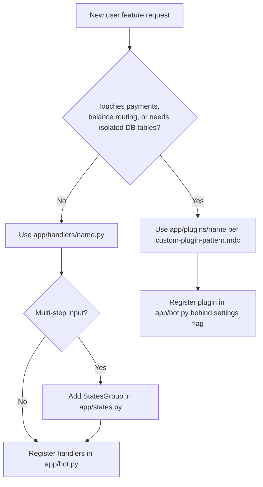

# Bot User Handler

Use this skill when adding a user-facing Telegram bot feature: a menu item, callback flow, command, or multi-step input flow.

**Related skills:** `.cursor/skills/fa-i18n/SKILL.md` for Persian strings; `.cursor/rules/custom-plugin-pattern.mdc` for payment-like plugins.

## Before You Start

Follow the repository delivery rules:

- Start from `main` on a focused branch: `feat/<slug>`, `fix/<slug>`, or `i18n/<slug>` (strings only).
- Keep **one concern per commit**. Localization: at most one handler or keyboard file plus `app/localization/locales/fa.json`.
- Reuse existing services, handlers, keyboards, and `texts.t`; do not create parallel implementations.
- Read before editing: `feature-development.mdc`, `delivery-cycle.mdc`, `localization-upstream.mdc`, `telegram-callback-ux.mdc`, `user-surface-parity.mdc` (if user-visible text).

## Choose Handler Or Plugin



Prefer a plain handler in `app/handlers/<feature>.py` unless the feature is isolated, payment-like, or needs dedicated persistence. Use `app/plugins/c2c/` and `custom-plugin-pattern.mdc` only for plugin-shaped work.

Reference files:

- Simple callback flow: `app/handlers/support.py`
- Service-backed callback flow with pagination: `app/handlers/server_status.py`
- Dispatcher registration order: `app/bot.py`
- Main menu keyboard builder: `app/keyboards/inline.py`

## Scoping Checklist

Before editing, confirm or infer:

- Callback data prefix, such as `menu_<feature>` or `<feature>_page:`.
- Whether the feature needs a main menu entry, command, inline keyboard, or all three.
- Whether multi-step user input needs a `StatesGroup` in `app/states.py`.
- Whether business logic belongs in an existing service before creating `app/services/<feature>_service.py`.
- Whether the change affects cabinet or miniapp parity; if so, read `user-surface-parity.mdc` and `fa-i18n/SKILL.md`.
- Whether prices or balances are displayed; if so, read `currency-display-toman.mdc`.
- Whether `MENU_LAYOUT_ENABLED` is on (see below) — changes how the main menu button is wired.

## Main menu wiring (`MENU_LAYOUT_ENABLED`)

`settings.MENU_LAYOUT_ENABLED` (default `false` in `config.py` / `.env.example`) controls **how the main menu is built**, not whether handlers exist.

| Flag | Menu source | How to add a main-menu button |
|------|-------------|-------------------------------|
| `false` | Hardcoded `get_main_menu_keyboard()` in `app/keyboards/inline.py` | Edit `get_main_menu_keyboard` (or `_build_cabinet_main_menu_keyboard` in cabinet mode) |
| `true` | `MenuLayoutService.build_keyboard()` from DB (`SystemSetting` key `menu_layout_config`) | 1) Handler + `bot.py` registration (always). 2) Add button via Web API `/menu-layout` or `MenuLayoutService.add_custom_button` — editing `inline.py` alone is **not enough** |

When `true`, `get_main_menu_keyboard_async` in `inline.py` skips the hardcoded builder and uses DB config with visibility/conditions (subscription active, admin, etc.). `ButtonStatsMiddleware` also logs menu clicks.

**Still required in both modes:** `register_handlers` in `bot.py` with matching `callback_data` (e.g. `F.data == 'menu_feature'`).

## Implementation Workflow

1. Create or update `app/handlers/<feature>.py`.
   - Handlers are async module-level functions.
   - Use injected dependencies from middleware: `db_user: User`, `db: AsyncSession`, `state: FSMContext`.
   - Keep Telegram event types explicit: `types.CallbackQuery`, `types.Message`.

2. Add FSM states only when needed.
   - Put them in `app/states.py`: `class FeatureStates(StatesGroup): waiting_input = State()`.
   - Register message handlers with the state and a filter, such as `F.text`.

3. Add keyboard builders.
   - Use `app/keyboards/inline.py` for small, shared inline keyboards.
   - Use `app/keyboards/<feature>.py` if the feature has several dedicated keyboards.
   - Accept `language: str` and use `texts = get_texts(language)` for button labels.

4. Add service code only for real business logic.
   - Prefer existing services first.
   - Keep formatting and Telegram-specific code in handlers, not services.

5. Add localization when user-visible text is introduced.
   - Follow `fa-i18n/SKILL.md`: `texts.t('FEATURE_KEY', 'Cyrillic fallback')` + `app/localization/locales/fa.json`.
   - If cabinet/miniapp show the same text: parity in same slice (`app/cabinet/routes/**`, `miniapp.py`, `cabinet/src/locales/fa.json`).

6. Register handlers.
   - Export `register_handlers(dp: Dispatcher) -> None` from the handler module.
   - Import and call it from `app/bot.py` near peer user handlers.

7. Wire the menu entry if needed.
   - `MENU_LAYOUT_ENABLED=false` → update `get_main_menu_keyboard` in `inline.py`.
   - `MENU_LAYOUT_ENABLED=true` → add button to menu layout config (API/DB); optional: register callback in `AVAILABLE_CALLBACKS` / builtin list if integrating deeply.

## Handler Conventions

- **Callback UX:** After cheap validation, call `await callback.answer()` before slow I/O (DB, Redis, RemnaWave API, balance, `edit_text`). See `telegram-callback-ux.mdc`.
- For alert errors: `await callback.answer(texts.t('KEY', 'Cyrillic fallback'), show_alert=True)` and return.
- Use `edit_or_answer_photo` from `app/utils/photo_message.py` when matching existing menu screens that may contain photos.
- For prices and balances: `texts.format_price(...)`, `texts.format_balance(...)`. Do not hardcode currency symbols.
- For dates shown to fa users: `format_user_datetime(..., language=db_user.language)` from `app/utils/jalali_datetime.py`.
- Feature flags live on `settings` and are checked near entry points.
- Logging: `structlog.get_logger(__name__)` when the handler has meaningful failure paths.

## Registration Pattern

```python
from aiogram import Dispatcher, F, types

from app.database.models import User
from app.localization.texts import get_texts


async def show_feature(callback: types.CallbackQuery, db_user: User) -> None:
    texts = get_texts(db_user.language)
    await callback.answer()
    await callback.message.edit_text(
        texts.t('FEATURE_TITLE', '<b>Название функции</b>'),
        reply_markup=None,
    )


def register_handlers(dp: Dispatcher) -> None:
    dp.callback_query.register(show_feature, F.data == 'menu_feature')
```

For multi-step flows:

```python
def register_handlers(dp: Dispatcher) -> None:
    dp.callback_query.register(start_feature, F.data == 'menu_feature')
    dp.message.register(process_feature_input, FeatureStates.waiting_input, F.text)
    dp.callback_query.register(cancel_feature, F.data == 'feature_cancel')
```

More scaffolds are in `templates.md`.

## Anti-Patterns

Do not:

- Create a plugin for i18n-only or display-only work.
- Use `get_admin_texts` in user-facing handlers.
- Define module-level `texts = ...`.
- Touch hot paths (`purchase.py`, `tariff_purchase.py`, `start.py`, `inline.py`) unless the request specifically needs them.
- Mix display currency work with FX, Stars, crypto, or provider amount logic.
- Add raw `₽` to new user-visible strings.
- Commit `locales/`; source of truth is `app/localization/locales/fa.json`.
- Add a menu button only in `inline.py` when `MENU_LAYOUT_ENABLED=true` (users will not see it).

## Verification

Before saying the handler work is complete:

```bash
docker compose run --rm --no-deps bot python -c "import main"
```

If `app/localization/locales/fa.json` changed:

```bash
cp app/localization/locales/fa.json ./locales/fa.json
docker compose restart bot
```

Do not commit `./locales/`. User smoke on Telegram (and cabinet if parity touched) before merge.
