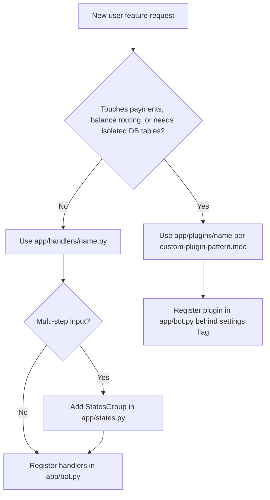

# Bot User Handler

Use this skill when adding a user-facing Telegram bot feature: a menu item, callback flow, command, or multi-step input flow.

## Before You Start

Follow the repository delivery rules:

- Start from `main` on a focused branch such as `feat/<slug>` or `chore/<slug>`.
- Keep one concern per commit. For localization work, touch at most one handler or keyboard file plus `app/localization/locales/fa.json`.
- Reuse existing services, handlers, keyboards, and `texts.t`; do not create parallel implementations.
- Read relevant rules before editing: `.cursor/rules/feature-development.mdc`, `.cursor/rules/delivery-cycle.mdc`, `.cursor/rules/localization-upstream.mdc`, and `.cursor/rules/telegram-callback-ux.mdc`.

## Choose Handler Or Plugin



Prefer a plain handler in `app/handlers/<feature>.py` unless the feature is isolated, payment-like, or needs dedicated persistence. Use `app/plugins/c2c/` and `.cursor/rules/custom-plugin-pattern.mdc` only for plugin-shaped work.

Reference files:

- Simple callback flow: `app/handlers/support.py`
- Service-backed callback flow with pagination: `app/handlers/server_status.py`
- Dispatcher registration order: `app/bot.py`
- Main menu keyboard builder: `app/keyboards/inline.py`

## Scoping Checklist

Before editing, confirm or infer:

- Callback data prefix, such as `menu_<feature>` or `<feature>_page:`.
- Whether the feature needs a main menu entry, command, inline keyboard, or all three.
- Whether multi-step user input needs a `StatesGroup` in `app/states.py`.
- Whether business logic belongs in an existing service before creating `app/services/<feature>_service.py`.
- Whether the change affects cabinet or miniapp parity; if so, read `.cursor/rules/user-surface-parity.mdc`.
- Whether prices or balances are displayed; if so, read `.cursor/rules/currency-display-toman.mdc`.

## Implementation Workflow

1. Create or update `app/handlers/<feature>.py`.
   - Handlers are async module-level functions.
   - Use injected dependencies from middleware, usually `db_user: User`, `db: AsyncSession`, and `state: FSMContext`.
   - Keep Telegram event types explicit: `types.CallbackQuery`, `types.Message`.

2. Add FSM states only when needed.
   - Put them in `app/states.py`.
   - Name them `<Feature>States`.
   - Register message handlers with the state and a filter, such as `F.text`.

3. Add keyboard builders.
   - Use `app/keyboards/inline.py` for small, shared inline keyboards.
   - Use `app/keyboards/<feature>.py` if the feature has several dedicated keyboards.
   - Accept `language: str` and use `texts = get_texts(language)` for button labels.

4. Add service code only for real business logic.
   - Prefer existing services first.
   - Keep formatting and Telegram-specific code in handlers, not services.

5. Add localization keys when user-visible text is introduced.
   - Use `texts = get_texts(db_user.language)`.
   - Use `texts.t('FEATURE_KEY', 'Cyrillic fallback')` in code.
   - Add Persian values to `app/localization/locales/fa.json`.
   - Preserve placeholder names exactly between code and JSON.

6. Register handlers.
   - Export `register_handlers(dp: Dispatcher) -> None` from the handler module.
   - Import and call it from `app/bot.py` near peer user handlers.

7. Wire the menu entry if needed.
   - For static menu buttons, update the relevant builder in `app/keyboards/inline.py`.
   - If `MENU_LAYOUT_ENABLED` applies, account for DB-driven layout through `MenuLayoutService`.

## Handler Conventions

- Callback UX matters. After cheap validation, call `await callback.answer()` before slow I/O such as DB queries, Redis, RemnaWave API calls, balance subtraction, or message rendering.
- For alert errors, call `await callback.answer(texts.t('KEY', 'Cyrillic fallback'), show_alert=True)` and return.
- Use `edit_or_answer_photo` from `app/utils/photo_message.py` when matching existing menu screens that may contain photos.
- For prices and balances, use `texts.format_price(...)`, `texts.format_balance(...)`, or existing settings formatters. Do not hardcode currency symbols.
- Feature flags should live on `settings` and be checked near entry points.
- Logging should use `structlog.get_logger(__name__)` when the handler has meaningful failure paths.

## Registration Pattern

```python
from aiogram import Dispatcher, F, types

from app.database.models import User
from app.localization.texts import get_texts


async def show_feature(callback: types.CallbackQuery, db_user: User) -> None:
    texts = get_texts(db_user.language)
    await callback.answer()
    await callback.message.edit_text(
        texts.t('FEATURE_TITLE', '<b>Название функции</b>'),
        reply_markup=None,
    )


def register_handlers(dp: Dispatcher) -> None:
    dp.callback_query.register(show_feature, F.data == 'menu_feature')
```

For multi-step flows:

```python
def register_handlers(dp: Dispatcher) -> None:
    dp.callback_query.register(start_feature, F.data == 'menu_feature')
    dp.message.register(process_feature_input, FeatureStates.waiting_input, F.text)
    dp.callback_query.register(cancel_feature, F.data == 'feature_cancel')
```

More scaffolds are in `templates.md`.

## Anti-Patterns

Do not:

- Create a plugin for i18n-only or display-only work.
- Use `get_admin_texts` in user-facing handlers.
- Define module-level `texts = ...`.
- Touch hot paths such as `purchase.py`, `tariff_purchase.py`, or `start.py` unless the request specifically needs them.
- Mix display currency work with FX, Stars, crypto, or provider amount logic.
- Add raw `₽` to new user-visible strings.
- Commit `locales/`; it is a Docker mount copy, not source of truth.

## Verification

Before saying the handler work is complete:

```bash
docker compose run --rm --no-deps bot python -c "import main"
```

If `app/localization/locales/fa.json` changed, copy it to `./locales/fa.json` for deployment smoke and restart the bot, but do not commit `locales/`.
