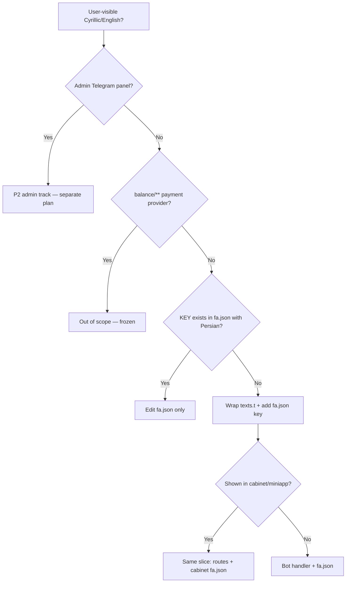

# fa-i18n (Persian user surfaces)

Use this skill for **user-visible** Persian text in the Telegram bot, cabinet API routes, miniapp API, and cabinet React UI. Not for admin Telegram panels, payment provider internals, or structural refactors.

**Companion rules (read before editing):** `.cursor/rules/localization-upstream.mdc`, `user-surface-parity.mdc`, `currency-display-toman.mdc`, `telegram-callback-ux.mdc`, `delivery-cycle.mdc`. Living status: `.cursor/rules/fa-i18n-status.mdc`.

**Related skill:** `.cursor/skills/bot-user-handler/SKILL.md` when adding a new feature *and* its strings together.

---

## Philosophy (non-negotiable)

1. **Isolated strings only** — wrap hardcoded text in `texts.t('KEY', 'Cyrillic fallback')`; add Persian to `fa.json`. No renames, no bulk codemods, no regex sweeps across files.
2. **Upstream merge safe** — Cyrillic stays in the **second argument** of `texts.t`. Never remove upstream fallbacks.
3. **One concern per commit** — at most **one** handler or keyboard file + `fa.json` (and parity surfaces in the **same slice** when required). Branch: `i18n/<slug>` from `main`.
4. **No parallel i18n systems** — no `get_admin_texts`, no module-level `texts =`, no bulk `MSG_*` constants.

---

## Scope

| In scope | Out of scope (separate track / never in fa slice) |
|----------|---------------------------------------------------|
| `app/localization/locales/fa.json` | `app/handlers/admin/**` (admin uses `get_texts(user.language)` — P2 track) |
| `app/handlers/**` except admin | `app/handlers/balance/**` (payment providers — frozen) |
| `app/keyboards/inline.py`, `reply.py` | `app/services/payment/**`, webhook amount logic |
| `app/cabinet/routes/**` user messages | `ru.json` codemods, bulk refactors |
| `app/webapi/routes/miniapp.py` user messages | Currency FX (`currency-fx-boundaries.mdc`) in same commit |
| `cabinet/src/locales/fa.json` | Committing `./locales/` Docker mount copy |

---

## Hard rules (bug prevention)

### Text wrapping

```python
texts = get_texts(db_user.language)  # or get_texts(user.language)
await callback.answer(texts.t('FEATURE_KEY', 'Кириллический fallback'), show_alert=True)
body = texts.t('FEATURE_BODY', '<b>Заголовок</b>').format(price=formatted)
```

| Rule | Why |
|------|-----|
| Second arg of `texts.t` = **Cyrillic** from upstream | Upstream merge diff stays linear |
| If `KEY` already has correct Persian in `fa.json` | **Only edit JSON** — do not touch handler |
| `get_texts(user.language)` per call site | Module-level `texts =` breaks multi-language |
| Never `get_admin_texts` in user paths | `grep -r get_admin_texts app/` must stay **0** |
| Placeholder names **identical** to `ru.json` | `{price}` not `{amount}` — wrong name → `KeyError` |
| Pre-format prices: `texts.format_price(kopeks)` then `.format(price=...)` | Never embed `₽` or raw integers in locale strings |
| Missing `fa` key | Runtime falls back to `ru` via `loader.py` (`UPSTREAM_FALLBACK_LOCALE`); still add the key to `fa.json` |

### Copy style (fa)

| Rule | Example |
|------|---------|
| **English digits** `0-9` only | `100,000 تومان` — never `۱۰۰٬۰۰۰` |
| **Comma thousands** in amounts | Use `texts.format_price` / `format_balance` — do not hand-format |
| **Currency suffix** | `تومان` via formatter — never new `₽` in user strings |
| User-facing **تعرفه** → **سرویس** | Consistent product terminology (see fa-i18n-status P3) |
| Telegram HTML | Preserve `<b>`, `<i>`, `<code>` from `ru.json` structure |

### Dates (fa users)

| Surface | Use |
|---------|-----|
| Bot handlers, cabinet routes, miniapp | `format_user_datetime(dt, language=user.language)` from `app/utils/jalali_datetime.py` |
| Cabinet React | `formatUserDate(iso, lang)` from `cabinet/src/utils/formatDate.ts` (`fa-IR-u-nu-latn` + Persian calendar) |
| Do not | Hardcode `DD.MM.YYYY` Gregorian for `language == 'fa'` |

### Callback UX

`texts.t` does **not** delay Telegram spinners. Call `await callback.answer()` **before** slow I/O. See `telegram-callback-ux.mdc`. i18n commits must not reorder answer vs I/O unless fixing a spinner bug in the **same** handler file.

### Currency (layer 2 only)

Display Toman: `texts.format_price`, `texts.format_balance`, `{price}` in strings. **Never** mix with FX (Stars rates, `kopeks_to_rubles`, crypto) in the same commit. See `currency-display-toman.mdc`.

---

## Surface parity (mandatory)

Hidden failure: bot Persian but cabinet/miniapp still Cyrillic or `₽`.

| Change type | Touch in same slice (or PR note: **cabinet/miniapp follow-up**) |
|-------------|----------------------------------------------------------------|
| New/changed key in `app/localization/locales/fa.json` used in bot | Same keys in `cabinet/src/locales/fa.json` if cabinet UI shows them |
| Bot handler user message | `app/cabinet/routes/**` + `app/webapi/routes/miniapp.py` if same flow exists |
| Price/balance display | `texts.format_price` / `settings.format_price` on all three surfaces |
| Date in user UI | `format_user_datetime` (API) + `formatUserDate` (cabinet pages) |

**Source of truth for bot strings:** `app/localization/locales/fa.json`  
**Cabinet UI strings:** `cabinet/src/locales/fa.json`  
**Deploy mount:** copy `app/localization/locales/fa.json` → `./locales/fa.json` after change; **do not commit** `./locales/`.

---

## Workflow per slice

```
1. Branch: git checkout -b i18n/<slug> main
2. Grep source file for Cyrillic / hardcoded user strings (not logs/docstrings)
3. For each string: pick KEY (check ru.json for name + placeholders)
4. Wrap: texts.t('KEY', 'exact Cyrillic from code')
5. Add Persian value to app/localization/locales/fa.json
6. Parity: cabinet routes / miniapp / cabinet/src/locales/fa.json if needed
7. Placeholder smoke: .format(**kwargs) with same names as ru.json
8. Agent smoke: docker compose run --rm --no-deps bot python -c "import main"
9. If fa.json changed: cp app/localization/locales/fa.json ./locales/fa.json && docker compose restart bot
10. Commit: i18n(fa): <one-file description>
11. Update fa-i18n-status.mdc (5–10 lines Done/Next)
```

### Commit message format

```
i18n(fa): wrap <handler> callback toasts
i18n(fa): localize <KEY> in fa.json only
i18n(fa): cabinet parity for <feature> balance labels
```

---

## Decision tree



---

## Anti-patterns (never)

- Multi-file handler commits for i18n
- Plugin for i18n-only or display-only work
- Touching `purchase.py`, `tariff_purchase.py`, `start.py`, `inline.py` hot paths unless the task explicitly requires it
- Regex/log/docstring localization sweeps
- New `₽` or Russian in `fa.json` values
- Persian digits `۰-۹` in amounts or counts
- Ad-hoc `/100` or `*100` for display in handlers
- Committing `./locales/` directory
- Mixing display currency (layer 2) and FX (layer 3) in one commit
- Removing Cyrillic fallbacks from code to "clean up"
- Using `get_admin_texts` anywhere

---

## Verification checklist

Before marking slice complete:

- [ ] Only one handler/keyboard file changed (+ fa.json + parity files if same slice)
- [ ] Every new `texts.t` has Cyrillic second argument
- [ ] Placeholders match `ru.json` (grep both files for the KEY)
- [ ] No new `₽` / Cyrillic left in user-visible paths for `fa` users
- [ ] Dates use Jalali helpers where `{date}` / `{expires_at}` shown to fa users
- [ ] Amounts use `format_price` / `format_balance`
- [ ] `docker compose run --rm --no-deps bot python -c "import main"` passes
- [ ] `grep -r get_admin_texts app/` → 0
- [ ] `fa-i18n-status.mdc` updated
- [ ] User smoke: Telegram (and cabinet if touched) — **user approves before merge**

---

## Examples

See [examples.md](examples.md) for handler, keyboard, fa.json, cabinet route, and miniapp patterns.

---

## When to stop and ask the user

- Task requires admin panel localization (scope creep → P2 plan)
- Task requires payment provider / balance handler strings
- Task requires both Toman display **and** Stars/crypto FX changes
- Placeholder names differ between `ru.json` and existing `fa.json` for the same KEY
- Upstream merge conflict on hot files — do not improvise; show conflict and wait
