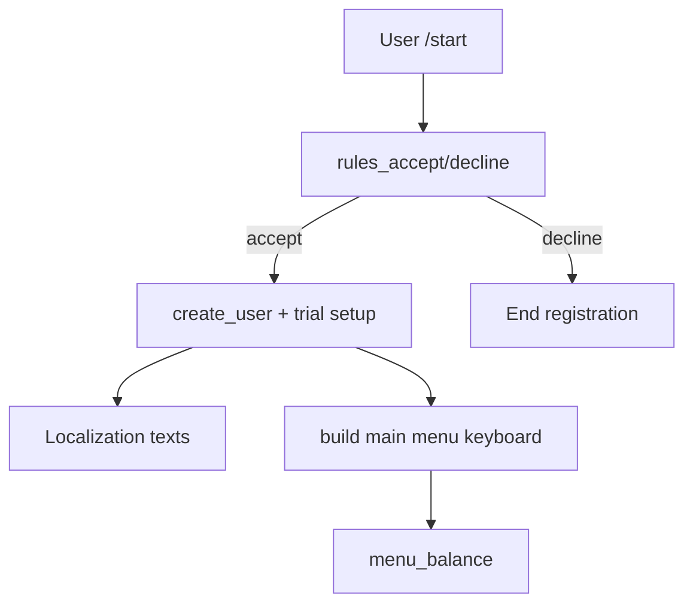
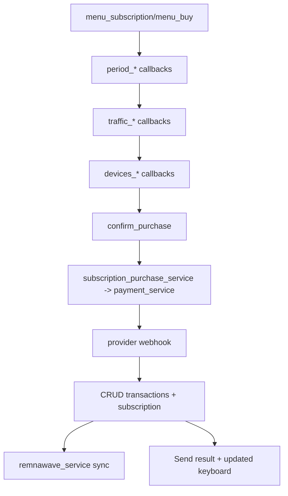

# Telegram Bot Keyboard/State/Service Mapping (aiogram)

Scope: Telegram bot (aiogram 3) including user and admin flows. Sources: `main.py`, `app/bot.py`, `app/states.py`, `app/config.py`, `app/keyboards/{inline.py,reply.py,admin.py}`, key handler registrations (`app/handlers/**`).

## Dispatcher & Middleware Setup
- Entry: `main.py` → `initialize_all_bots()` → `setup_bot()` creates Bot + Dispatcher with RedisStorage (fallback MemoryStorage).
- Middlewares (message/callback/pre_checkout): `GlobalError`, `BotContext`, `Logging`, `Maintenance`, `DisplayNameRestriction`, `Throttling`, `Auth`, `SubscriptionStatus`; optional `ChannelChecker`.
- Handlers registered in `app/bot.py` (user, subscription, balance, promocode, referral, support, server_status, tickets, polls, simple_subscription, stars payments, admin modules, common).
- Run modes: polling/webhook/both via settings; unified web server handles webhooks and payment webhooks.

## FSM State Inventory (from `app/states.py`)
- Registration: language, rules_accept, privacy_policy_accept, referral_code.
- Subscription: selecting_period/traffic/countries/devices, confirming_purchase, add/extend/reset variants, cart_saved_for_topup, simple_subscription_payment_method.
- Balance: waiting_for_amount, payment-method-specific states (pal24, platega, stars), support request, card-to-card receipt.
- PromoCode: waiting_for_code/referral_code.
- Support/Tickets: support message; ticket title/message/reply; admin ticket reply/block.
- Admin: extensive states for users, subscriptions, promo, campaigns, broadcasts, promo groups, pricing edits, content edits, server edits, tenant bots, notification settings, promo offers, navigation source tracking.
- Other: SupportSettings, BotConfig, Pricing, AutoPay, Squad create/rename/migration, RemnaWave sync schedule, AdminSubmenu navigation.

## Keyboards Inventory
- Reply keyboards (`app/keyboards/reply.py`):
  - `get_main_reply_keyboard`: Balance, Subscription, Promocode, (Referral if enabled), Support, Rules.
  - `get_admin_reply_keyboard`: Users, Subscriptions, Promocodes, Messages, Statistics, Monitoring, Main Menu.
  - Cancel/confirmation/skip/contact/location keyboards.
- Inline keyboards (`app/keyboards/inline.py`):
  - Onboarding: rules accept/decline (`rules_accept`, `rules_decline`), privacy accept/decline, referral skip, channel check (`sub_channel_check`).
  - Language selection: `language_select:{code}`, optional back.
  - Post-registration: trial activate (`trial_activate`), `back_to_menu`.
  - Main menu: profile (web_app or `menu_profile_unavailable`), language (`menu_language`), support (`menu_support`), admin (`admin_panel`), moderator, balance (`menu_balance`), subscription (`menu_subscription`), buy (`menu_buy`/`subscription_purchase`/`subscription_upgrade`), trial (`menu_trial`), connect (`subscription_connect`/link/web_app), happ download buttons, saved cart notice, simple purchase (`simple_subscription_purchase`), subscription settings, promo, referral, support, info/rules/privacy/public offer/FAQ, server status.
  - Subscription flow: `period_*`, `traffic_*`, `devices_*`, switch/confirm, extend, reset traffic/devices, add countries, summary/checkout, `confirm_purchase`, `cancel_purchase`, `subscription_reset_*`, `subscription_add_*`, `subscription_extend`, `subscription_change_devices`.
  - Balance flow: `menu_balance`, per-provider buttons (`topup_yookassa`, `topup_cryptobot`, `topup_mulenpay`, `topup_platega`, `topup_wata`, `topup_pal24`, `topup_heleket`, `topup_stars`), quick amounts (`quick_amount_{kopeks}`, `topup_amount|method|amount`), check status (`check_{provider}_*`), payment unavailable.
  - Misc: promo groups info, polls, stars payments callbacks, miniapp/custom buttons via `build_miniapp_or_callback_button`.
- Admin inline keyboards (`app/keyboards/admin.py`):
  - Main: Users/Subscriptions, Servers, Pricing, Promo/Stats, Support, Messages, Settings, System, Tenant bots, Trials, Payments, Back to menu.
  - Submenus: users, promo, communications, support, settings, system; trials/reports keyboards; users list/filter, subscriptions list/expiring/countries, servers CRUD, pricing menus, promo codes/groups/offers, campaigns, polls, messages/broadcast, monitoring, maintenance, rules/privacy/public offer/FAQ, bot config, support settings, tickets/audit, payments, backups/logs/updates/reports, tenant bots management.

## User Flow Mappings (trigger → handler/state → services)
- `/start` (`Command("start")`, `start.py`):
  - Shows language/rules/privacy keyboards → states: `RegistrationStates.waiting_for_language/rules_accept/privacy_policy_accept/referral_code`.
  - Services/CRUD: user creation (`create_user`), referral code generation, rules/privacy fetch, locale loader; channel check may gate progress.
  - Success → main menu keyboard from `get_main_menu_keyboard`.
- Main menu (`menu.py`):
  - `back_to_menu` → rebuild menu (uses user/service data, saved carts, subscription status).
  - `menu_language`/`language_select:*` (StateFilter None) → update user language.
  - `menu_rules`, `menu_privacy_policy`, `menu_public_offer`, `menu_faq*`, `menu_info*` → content pages from services (`rules/privacy/public_offer/faq/welcome_text`, system settings).
  - `menu_support` → support flow (`support.py`), may open tickets or contact based on settings.
  - `menu_balance` → balance handlers.
  - `menu_subscription` → subscription settings/info; `menu_trial`/`trial_activate` for trial activation.
- Subscription purchase/settings (`subscription/purchase.py`):
  - Entry: `menu_subscription` (view), `menu_buy`/`subscription_purchase`/`subscription_upgrade` (start purchase).
  - States: `SubscriptionStates.selecting_period/traffic/devices/countries`, `confirming_purchase`, add/extend/reset variants, `cart_saved_for_topup`, `waiting_for_simple_subscription_payment_method`.
  - Callbacks: `period_*`, `traffic_*`, `devices_*`, `subscription_add_*`, `subscription_extend`, `subscription_change_devices`, `subscription_reset_traffic/devices`, `confirm_reset_*`, `confirm_purchase`, `cancel_purchase`, `subscription_connect`, `open_subscription_link`, `subscription_switch_traffic` (+confirm), `add_devices_*`, `extend_period_*`.
  - Services: `subscription_service`, `subscription_purchase_service`, `subscription_checkout_service`, `subscription_auto_purchase_service`, `user_cart_service`, `promo_offer_service`, `subscription_renewal_service`, `remnawave_service` (sync), pricing utils; CRUD via `subscriptions`, `transactions`, `promo`.
  - External: RemnaWave API for subscription links/sync, payment providers indirectly via payment service when purchase confirms.
  - Data dependencies: settings for prices, connect button mode (miniapp/link/happ), simple subscription settings.
- Balance / Payments (`handlers/balance/*.py`):
  - Entry callbacks: `menu_balance`, provider buttons (`topup_{provider}`), quick amounts (`quick_amount_*`, `topup_amount|method|amount`), status checks (`check_{provider}_*`), SBP instructions, payment_methods_unavailable.
  - States: `BalanceStates.waiting_for_amount`, provider-specific (pal24/platega/stars/support/card_to_card).
  - Services: `payment_service`, `payment_verification_service`, provider services (`app/services/payment/*.py`), `user_service` (balance updates), `admin_notification_service`.
  - External: YooKassa, CryptoBot, Heleket, MulenPay, Pal24, Platega, WATA, Telegram Stars webhooks.
  - Data flow: build invoice → store transaction → await webhook/verification → update transaction/user balance → notify user/admin.
- Promo code (`promocode.py`):
  - Trigger: `MENU_PROMOCODE` button (reply) or inline prompt; state `PromoCodeStates.waiting_for_code/referral_code`.
  - Services: `promocode_service`, `referral_service`, `subscription_service` (apply discount), CRUD `promocode`, `promo_group`, `users`.
- Referral (`referral.py`):
  - Trigger: reply button or inline; shows referral link/stats; service `referral_service`, CRUD `referrals`, `users`, `transactions`.
- Support (`support.py`):
  - Trigger: `menu_support`; modes: tickets/contact/both based on settings.
  - States: `BalanceStates.waiting_for_support_request` or `SupportStates.waiting_for_message`.
  - Services: `support_settings_service`, `ticket_service`/CRUD `tickets`, notifications to admin chats.
- Tickets (`tickets.py` user side):
  - Trigger: reply/menu support; states `TicketStates.waiting_for_title/message/reply`.
  - Services: `ticket_service`, `admin_notification_service`; CRUD `tickets`, `users`.
- Server status (`server_status.py`):
  - Trigger: `MENU_SERVER_STATUS` callback (if enabled).
  - Services: `server_status_service` (may call external metrics URL) ; CRUD `servers`.
- Polls (`polls.py` + `handlers/admin/polls.py`):
  - User callbacks for answering polls; services: `poll_service`, CRUD `polls`, `user_polls`.
- Simple subscription (`simple_subscription.py`):
  - Trigger: `simple_subscription_purchase` button (from main menu if enabled).
  - State: `SubscriptionStates.waiting_for_simple_subscription_payment_method`.
  - Services: `subscription_service`, `subscription_purchase_service`, payment services; settings for simple plan parameters.
- Stars payments (`handlers/stars_payments.py`):
  - Trigger: `topup_stars`, callbacks from Telegram Stars; services: `payment_service`, `stars` provider service; updates balance.

## Admin Flow Mappings (high level)
- Admin panel entry: inline button `admin_panel` (from main menu); `admin/main.py` shows admin main keyboard (`get_admin_main_keyboard`).
- Submenus and key callbacks:
  - Users/Subscriptions: `admin_users`, `admin_users_list/search/stats/filters`, `admin_subscriptions`, `admin_subs_list/expiring/countries`; services: `user_service`, `subscription_service`, filters/pagination; CRUD users/subscriptions.
  - Servers: `admin_servers` → server list/create/edit callbacks; services: `system_settings_service`, CRUD `servers`, `squads`.
  - Pricing: `admin_pricing` → edit traffic/device/period prices; services: `system_settings_service`, `pricing` CRUD.
  - Promo/Stats: `admin_promocodes`, `admin_promo_groups`, `admin_campaigns`, `admin_statistics`; services: `promocode_service`, `promo_group_assignment`, `campaign_service`, reporting; CRUD promo/campaign/transactions.
  - Support: `admin_tickets`, `admin_support_settings`, `admin_support_audit`; services: `support_settings_service`, `ticket_service`.
  - Communications: `admin_messages` (broadcast), `admin_polls`, `admin_promo_offers`, `welcome_text_panel`, `user_messages_panel`; services: `broadcast_service`, `poll_service`, `promo_offer_service`, content services.
  - Settings: `admin_remnawave`, `admin_monitoring`, `admin_bot_config`, `admin_rules/privacy/public_offer/faq`, `maintenance_panel`; services: `remnawave_service`, `monitoring_service`, `system_settings_service`, `maintenance_service`, content services.
  - System: `admin_updates`, `backup_panel`, `admin_system_logs`, `admin_reports`; services: `version_service`, `backup_service`, `reporting_service`, log viewers.
  - Payments/Trials: `admin_payments`, `admin_trials`; services: `payment_service`, `trial_activation_service`.
  - Tenant bots: `admin_tenant_bots_menu`; services: bot CRUD, dynamic dispatcher initialization (`initialize_single_bot`), maintenance_service.
  - Navigation states: `AdminSubmenuStates` track current submenu; many handlers use them to route back.

## Service Dependency Highlights
- Presentation (keyboards/handlers) → Business services (`app/services/*.py`) → CRUD (`app/database/crud`) → Models (`app/database/models.py`) → External APIs (`app/external/*.py`) as needed.
- User registration/trial: `user_service`, `trial_activation_service`, `remnawave_service`.
- Subscription flows: `subscription_service`, `subscription_purchase_service`, `subscription_checkout_service`, `subscription_renewal_service`, `subscription_auto_purchase_service`, `promo_offer_service`, `user_cart_service`, `remnawave_service`.
- Payments/top-ups: `payment_service`, provider-specific services (`payment/`), `payment_verification_service`, `admin_notification_service`.
- Support/tickets: `support_settings_service`, `ticket_service`, `admin_notification_service`.
- Admin config/content: `system_settings_service`, `main_menu_button_service`, `welcome_text`, `privacy_policy_service`, `public_offer_service`, `faq_service`, `notification_settings_service`.
- Monitoring/maintenance: `monitoring_service`, `maintenance_service`, `version_service`, `backup_service`, `reporting_service`, `remnawave_sync_service`.

## Example Data Flows





```mermaid
flowchart TD
  balanceEntry[menu_balance] --> providerBtn[topup_{provider}]
  providerBtn --> invoice[PaymentService create invoice]
  invoice --> webhook[Provider webhook server]
  webhook --> paymentVerify[payment_verification_service]
  paymentVerify --> txUpdate[Update transaction + user balance]
  txUpdate --> notify[User/admin notifications]
```

## Change-Impact Checklist (per button/handler)
- When adding a new button: update the corresponding keyboard builder; add handler with proper filters/state; ensure localization texts exist; wire to service method and CRUD; add admin counterpart if needed.
- When adding a new payment method: add provider service/client, keyboard entry, handler registration, webhook route, settings toggles, and manual/auto verification hooks.
- When altering subscription options: update settings (prices/periods/traffic/devices), keyboard generators (`inline.py`), and purchase handlers that parse callback data and update carts.
- Admin additions: extend `app/keyboards/admin.py`, register in relevant `admin/*.py`, ensure `AdminSubmenuStates` transitions, and add services/CRUD endpoints.
- Maintain FSM safety: ensure `StateFilter` aligns with expected states; clear or persist state when switching flows; saved carts (`user_cart_service`) must be cleaned on cancel.


