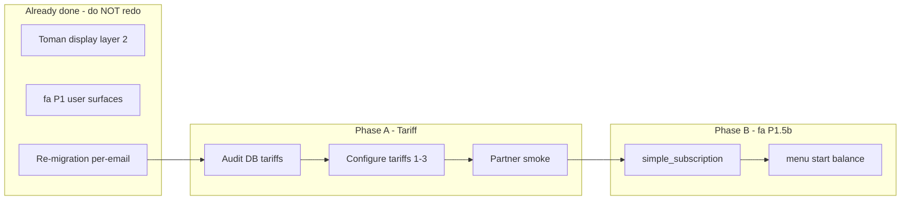

# Post-Migration Tariff + fa-i18n Implementation Plan

> **For agentic workers:** REQUIRED SUB-SKILL: Use superpowers:subagent-driven-development (recommended) or superpowers:executing-plans to implement this plan task-by-task. Steps use checkbox (`- [ ]`) syntax for tracking.

**Goal:** After migration merge, restore a coherent tariff/purchase UX (Persian names, all locations, partner placement) and finish remaining user-facing Persian strings — without redoing Toman display (layer 2 already shipped).

**Architecture:** Tariff work is **DB + config + optional one-shot script** (no parallel pricing engine). i18n work reuses `get_texts(user.language).t('KEY', 'ru fallback')` + `fa.json` only, one handler file per commit per [`localization-upstream.mdc`](.cursor/rules/localization-upstream.mdc). Toman audit is read-only; no `format_price` changes in this plan.

**Tech Stack:** Python 3, aiogram, FastAPI cabinet, PostgreSQL tariffs table, `fa.json`, Docker smoke.

**Save copy to:** [`docs/superpowers/plans/2026-06-08-post-migration-tariff-i18n.md`](docs/superpowers/plans/2026-06-08-post-migration-tariff-i18n.md) on execution.

---

## Current state (verified Jun 8 2026)

| Item | Status |
|------|--------|
| Migration | Done: 7413 users, 5604 subs, 242 partners (`partner_status=approved`) |
| PR #42 | `feat/migration-final` — migration tooling + executed run |
| PR #43 | `fix/my-subs-list-paging` — 6/page pagination, 2-col buttons |
| Toman display | **Done** — `PRICE_DISPLAY_SUFFIX=' تومان'`, `format_price`/`format_balance` in [`app/config.py`](app/config.py); cabinet `useCurrency.ts` skipFxConversion |
| Tariff id=1 | `Стандартный` — real prices; `allowed_squads` = **basic UUID only** |
| Tariff id=2/3 | Migration placeholders `Premium`/`Basic` from [`ensure_migration_tariffs`](tools/migration/load_postgres.py) — English names, `show_in_gift=false` |
| fa P1/P1.5 | Merged; **P1.5b deferred**: `simple_subscription.py`, `menu.py`, `start.py`, `balance/main.py` |



---

## Prerequisites (Phase 0)

### Task 0: Merge migration PRs

**Files:** none (git only)

- [ ] **Step 1:** User smoke on production bot: «سرویس‌های من» multi-account, renew, partner menu
- [ ] **Step 2:** Merge https://github.com/k4lantar4/remnabot/pull/42 → `main` (via `dev-local` per [`git-branch-workflow.mdc`](.cursor/rules/git-branch-workflow.mdc))
- [ ] **Step 3:** Merge https://github.com/k4lantar4/remnabot/pull/43 → `main`
- [ ] **Step 4:** Deploy: `docker compose build bot && docker compose restart bot`; copy `fa.json` if changed

### Task 0b: Toman audit (read-only — no code)

- [ ] **Step 1:** Confirm bot shows تومان on balance + purchase (not ₽)
- [ ] **Step 2:** Confirm cabinet price fields use Toman path ([`cabinet/src/hooks/useCurrency.ts`](cabinet/src/hooks/useCurrency.ts))
- [ ] **Step 3:** If OK, **skip all currency commits** in this plan

Expected: audit passes; **no Task in Phase A/B modifies `format_price` or FX**.

---

## Phase A — Tariff restoration

**Branch:** `feat/tariff-post-migration` from `main` after Phase 0.

**Design decisions (locked from user conversation):**

- Per-email multi-account stays; no cap for partners (`get_max_active_subscriptions_for_user` → 999999)
- Old VIP maps to subs: `vip=20` → tariff_id **2** (premium squad), `vip=1` → tariff_id **3** (basic squad) — already in migrated rows
- New purchases: primary tariff **id=1** with **both** squad UUIDs so all locations visible (old-bot parity)
- Partner difference: **`referral_commission_percent`** from `fl_sellers` (already migrated); purchase discount via **PromoGroup** only if audit shows gap — default: commission-only unless user requests PromoGroup slice

**Squad UUIDs** ([`tools/migration/squad_uuids.json`](tools/migration/squad_uuids.json)):

```json
{"basic": "66edb525-13d4-45f0-b7a6-c62578f4021c", "premium": "825696b5-348b-4e84-b71e-d91f21c399a2"}
```

### Task 1: Tariff audit script

**Files:**
- Create: [`tools/tariff_audit.py`](tools/tariff_audit.py)
- Test: [`tests/test_tariff_audit.py`](tests/test_tariff_audit.py)

- [ ] **Step 1: Write failing test**

```python
def test_tariff_audit_reports_three_rows():
    report = build_tariff_audit_report([
        {'id': 1, 'name': 'Стандартный', 'allowed_squads': ['66edb525-13d4-45f0-b7a6-c62578f4021c'], 'is_active': True},
        {'id': 2, 'name': 'Premium', 'allowed_squads': ['825696b5-348b-4e84-b71e-d91f21c399a2'], 'is_active': True},
        {'id': 3, 'name': 'Basic', 'allowed_squads': ['66edb525-13d4-45f0-b7a6-c62578f4021c'], 'is_active': True},
    ])
    assert report['tariff_count'] == 3
    assert report['tariff_1_missing_premium_squad'] is True
```

- [ ] **Step 2:** Run `pytest tests/test_tariff_audit.py::test_tariff_audit_reports_three_rows -v` — expect FAIL

- [ ] **Step 3:** Implement `build_tariff_audit_report()` + CLI `python -m tools.tariff_audit` (read-only SQL via async session)

- [ ] **Step 4:** Run test — expect PASS

- [ ] **Step 5:** Commit

```bash
git commit -m "chore(tariff): add read-only post-migration tariff audit"
```

### Task 2: Apply tariff configuration (one-shot)

**Files:**
- Create: [`tools/tariff_post_migration_apply.py`](tools/tariff_post_migration_apply.py)
- Modify: none in hot paths

**Target DB state after `--execute`:**

| id | name (DB) | allowed_squads | show_in_gift | tier_level | notes |
|----|-----------|----------------|--------------|------------|-------|
| 1 | `استاندارد` or keep + fa display key | **both** UUIDs | true | 1 | primary buy tariff |
| 2 | `پریمیوم` | premium UUID | false | 2 | migrated VIP subs only |
| 3 | `پایه` | basic UUID | false | 1 | migrated VIP subs only |

- [ ] **Step 1: Write failing test** for `build_tariff_updates()` pure function (input row dicts → patch dicts)

- [ ] **Step 2:** Run test — FAIL

- [ ] **Step 3:** Implement dry-run + `--execute` with `MIGRATION_BACKUP_DIR`-style gate OR require `--i-understand` flag; **never** touch subscription rows or panel users

```python
BASIC = '66edb525-13d4-45f0-b7a6-c62578f4021c'
PREMIUM = '825696b5-348b-4e84-b71e-d91f21c399a2'

UPDATES = {
    1: {'name': 'استاندارد', 'allowed_squads': [BASIC, PREMIUM], 'show_in_gift': True, 'display_order': 0},
    2: {'name': 'پریمیوم', 'allowed_squads': [PREMIUM], 'show_in_gift': False, 'display_order': 2, 'tier_level': 2},
    3: {'name': 'پایه', 'allowed_squads': [BASIC], 'show_in_gift': False, 'display_order': 1, 'tier_level': 1},
}
```

- [ ] **Step 4:** Run dry-run on server; user approves output

- [ ] **Step 5:** `--execute`; re-run `tools/tariff_audit.py` — `tariff_1_missing_premium_squad` false

- [ ] **Step 6:** Commit tool only (DB change is operational, not in git)

```bash
git commit -m "feat(tariff): post-migration apply script for tariffs 1-3"
```

### Task 3: Bot display keys for tariff names (optional fa.json-only)

**Files:**
- Modify: [`app/localization/locales/fa.json`](app/localization/locales/fa.json) — keys `TARIFF_NAME_1`, `TARIFF_NAME_2`, `TARIFF_NAME_3` **only if** UI reads names via keys; otherwise Persian names in DB (Task 2) suffice

- [ ] **Step 1:** Grep `tariff.name` in user handlers ([`my_subscriptions.py`](app/handlers/subscription/my_subscriptions.py), [`tariff_purchase.py`](app/handlers/subscription/tariff_purchase.py))
- [ ] **Step 2:** If direct DB name used, **skip this task** (Task 2 Persian names enough)
- [ ] **Step 3:** If needed, add fa keys + single helper in [`app/utils/formatting.py`](app/utils/formatting.py) — one commit max

### Task 4: Partner + purchase smoke checklist

**Files:** none

- [ ] **Step 1:** Partner user: `partner_status=approved`, commission % visible in referral/partner menu ([`app/handlers/referral.py`](app/handlers/referral.py))
- [ ] **Step 2:** Regular user: buy flow shows tariff 1 with all squads; prices in تومان
- [ ] **Step 3:** Migrated user: «اشتراک‌های من» shows `#N` labels with Persian tariff names
- [ ] **Step 4:** User sign-off before Phase B

---

## Phase B — fa-i18n P1.5b (deferred slices)

**Branch:** `i18n/p1-remainder-b` from `main` after Phase A merge.

**Rules:** [`localization-upstream.mdc`](.cursor/rules/localization-upstream.mdc) — **one handler file + fa.json per commit**; Cyrillic stays in code fallback (2nd arg to `t()`).

### Task 5: `simple_subscription.py` (split into 2 commits — file is large ~378 Cyrillic hits)

**Files:**
- Modify: [`app/handlers/simple_subscription.py`](app/handlers/simple_subscription.py)
- Modify: [`app/localization/locales/fa.json`](app/localization/locales/fa.json)

**Commit 5a — menu/keyboard paths only (lines ~1–400 approx, adjust by grep):**

- [ ] **Step 1:** Grep Cyrillic user strings in first half of file
- [ ] **Step 2:** Replace with `texts.t('KEY', 'ru fallback')`; add keys to fa.json
- [ ] **Step 3:** `docker compose run --rm --no-deps bot python -c "import main"`
- [ ] **Step 4:** Commit `i18n(fa): simple_subscription menus`

**Commit 5b — purchase/confirm paths (remainder):**

- [ ] Same steps; commit `i18n(fa): simple_subscription purchase flow`

### Task 6: `menu.py`

**Files:**
- Modify: [`app/handlers/menu.py`](app/handlers/menu.py)
- Modify: `fa.json` if new keys

- [ ] **Step 1:** Localize remaining Cyrillic user strings only (not admin)
- [ ] **Step 2:** Agent smoke + commit `i18n(fa): menu remainder`

### Task 7: `start.py`

**Files:**
- Modify: [`app/handlers/start.py`](app/handlers/start.py)
- Modify: `fa.json` if new keys

- [ ] Same pattern; commit `i18n(fa): start remainder`

### Task 8: `balance/main.py`

**Files:**
- Modify: [`app/handlers/balance/main.py`](app/handlers/balance/main.py) — **user-visible strings only**; do not localize payment provider internals (out of scope per rules)

- [ ] Same pattern; commit `i18n(fa): balance main user strings`

### Task 9: Close P1.5b

- [ ] Update [`fa-i18n-status.mdc`](.cursor/rules/fa-i18n-status.mdc) Done/Next
- [ ] User smoke: `/start`, menu, balance history, simple subscription buy
- [ ] PR → `dev-local` → `main` after approval

---

## Out of scope (separate plans)

- Admin panel fa (P2) — [`docs/superpowers/plans/2026-06-06-fa-i18n-p2-admin-bot.md`](docs/superpowers/plans/2026-06-06-fa-i18n-p2-admin-bot.md)
- FX / Stars / provider amounts — [`currency-fx-boundaries.mdc`](.cursor/rules/currency-fx-boundaries.mdc)
- Cabinet `withdrawal.py` language parity (optional follow-up)
- Re-running migration

---

## Self-review

| Spec requirement | Task |
|------------------|------|
| Merge migration + subs list fix | Task 0 |
| Toman not redone | Task 0b audit only |
| Tariff real config after placeholders | Tasks 1–2 |
| All locations on buy | Task 2 tariff id=1 both squads |
| Partner placement | Task 4 smoke; commission already migrated |
| fa P1.5b files | Tasks 5–8 |
| One concern per commit | Each task notes separate commits |
| No placeholders in plan | All paths and code samples filled |

---

## Execution handoff

Plan targets [`docs/superpowers/plans/2026-06-08-post-migration-tariff-i18n.md`](docs/superpowers/plans/2026-06-08-post-migration-tariff-i18n.md).

**Two execution options:**

1. **Subagent-Driven (recommended)** — fresh subagent per task, review between tasks
2. **Inline Execution** — batch with checkpoints using executing-plans skill

Which approach?
