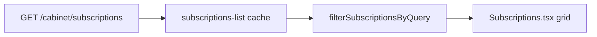

# Cabinet Subscriptions Search — Implementation Plan

> **For agentic workers:** REQUIRED SUB-SKILL: Use superpowers:subagent-driven-development or superpowers:executing-plans. Steps use checkbox (`- [ ]`) syntax.

**Goal:** Search/filter on the cabinet multi-tariff subscriptions list (`/subscriptions`), same semantics as bot `my_subscriptions` search (merged PR #51).

**Architecture:** Client-side filter on existing `subscriptionApi.getSubscriptions()` data. Shared TS util for display label + match rules (aligned with [`subscription_account_label`](app/utils/subscription_display.py)). No new API endpoints, no FSM, no bot changes.

**Tech Stack:** React, TanStack Query, i18next, existing glass theme.

**Branch:** `feat/cabinet-subscriptions-search` from `main`.

**Plan file:** [`docs/superpowers/plans/2026-06-09-cabinet-subscriptions-search.md`](docs/superpowers/plans/2026-06-09-cabinet-subscriptions-search.md)



**Bot reference (do not duplicate server-side):**

```77:90:app/handlers/subscription/my_subscriptions.py
def _subscription_matches_search(sub, query: str, texts) -> bool:
    ...
    if q in _account_display_name(sub, texts).lower():
        return True
    if q in str(getattr(sub, 'id', '')):
        return True
    tariff_name = ...
```

---

## Scope

| In | Out |
|----|-----|
| [`Subscriptions.tsx`](cabinet/src/pages/Subscriptions.tsx) search UI | New `GET ?q=` API |
| Shared label/filter util | Bot / miniapp.py message changes |
| [`SubscriptionListCard.tsx`](cabinet/src/components/subscription/SubscriptionListCard.tsx) uses shared label | Admin bulk pages |
| [`cabinet/src/locales/fa.json`](cabinet/src/locales/fa.json) user keys | `ru.json` bulk (fa-only slice per i18n rules) |

**Show search when:** `subscriptions.length >= 2` (same as bot `show_search`).

**Match fields:** display label (legacy `panel_username` or `{tariff} #{seq}`), subscription `id`, `tariff_name`. **Never** match raw `user_unknown_*` panel_username.

---

## File map

| File | Action |
|------|--------|
| `cabinet/src/utils/subscriptionDisplayLabel.ts` | Create — label + filter |
| `cabinet/src/components/subscription/SubscriptionListCard.tsx` | Use `getSubscriptionDisplayLabel` |
| `cabinet/src/pages/Subscriptions.tsx` | Search input + filtered grid |
| `cabinet/src/locales/fa.json` | Keys under `subscriptions.*` |

Cabinet has no vitest script; verify with `npm run build` + manual miniapp smoke.

---

### Task 1: Display label + filter util

**Files:**
- Create: `cabinet/src/utils/subscriptionDisplayLabel.ts`

- [ ] **Step 1: Add `getSubscriptionDisplayLabel`**

```typescript
import type { SubscriptionListItem } from '../types';

const USER_UNKNOWN_PREFIX = 'user_unknown_';

export function getSubscriptionDisplayLabel(
  sub: SubscriptionListItem,
  t: (key: string, fallback: string) => string,
  isMultiTariff = false,
): string {
  let panel = (sub.panel_username ?? '').trim();
  if (panel.startsWith(USER_UNKNOWN_PREFIX)) {
    panel = '';
  }
  if (panel) return panel;

  const defaultName = t('subscription.defaultName', 'Подписка');
  if (isMultiTariff && sub.account_sequence) {
    return `${sub.tariff_name || defaultName} #${sub.account_sequence}`;
  }
  return sub.tariff_name || defaultName;
}

export function subscriptionMatchesSearch(
  sub: SubscriptionListItem,
  query: string,
  t: (key: string, fallback: string) => string,
  isMultiTariff = false,
): boolean {
  const q = query.trim().toLowerCase();
  if (!q) return true;

  if (getSubscriptionDisplayLabel(sub, t, isMultiTariff).toLowerCase().includes(q)) {
    return true;
  }
  if (String(sub.id).includes(q)) return true;

  const tariffName = (sub.tariff_name ?? '').trim().toLowerCase();
  if (tariffName && tariffName.includes(q)) return true;

  return false;
}

export function filterSubscriptionsByQuery(
  subscriptions: SubscriptionListItem[],
  query: string,
  t: (key: string, fallback: string) => string,
  isMultiTariff = false,
): SubscriptionListItem[] {
  const q = query.trim();
  if (!q) return subscriptions;
  return subscriptions.filter((s) => subscriptionMatchesSearch(s, q, t, isMultiTariff));
}
```

- [ ] **Step 2: Commit** `feat(cabinet): subscription display label and search filter util`

---

### Task 2: SubscriptionListCard parity

**Files:**
- Modify: [`cabinet/src/components/subscription/SubscriptionListCard.tsx`](cabinet/src/components/subscription/SubscriptionListCard.tsx)

- [ ] Replace inline `displayName` block (lines 116–120) with:

```typescript
import { getSubscriptionDisplayLabel } from '../../utils/subscriptionDisplayLabel';

const displayName = getSubscriptionDisplayLabel(subscription, t, isMultiTariff);
```

- [ ] **Commit** `refactor(cabinet): use shared subscription display label in list card`

---

### Task 3: Search UI on Subscriptions page

**Files:**
- Modify: [`cabinet/src/pages/Subscriptions.tsx`](cabinet/src/pages/Subscriptions.tsx)

- [ ] Add `useMemo` import; state `searchQuery` string.

- [ ] After header block, when `subscriptions.length >= 2` and not loading:

```typescript
const filteredSubscriptions = useMemo(
  () => filterSubscriptionsByQuery(subscriptions, searchQuery, t, isMultiTariff),
  [subscriptions, searchQuery, t, isMultiTariff],
);
```

- [ ] Search row: styled `<input>` matching page glass theme (`g.cardBg`, `g.cardBorder`, `g.text`) — placeholder `t('subscriptions.searchPlaceholder', ...)`, optional clear button when `searchQuery` non-empty.

- [ ] When `searchQuery` active, show hint line: `t('subscriptions.searchActive', { query: searchQuery })`.

- [ ] Grid maps `filteredSubscriptions` instead of `subscriptions`.

- [ ] When `subscriptions.length > 0` but `filteredSubscriptions.length === 0`: empty state with `subscriptions.searchNoResults` + clear button.

- [ ] **Commit** `feat(cabinet): subscription list search on Subscriptions page`

---

### Task 4: Persian locale (separate commit)

**Files:** [`cabinet/src/locales/fa.json`](cabinet/src/locales/fa.json) — inside `"subscriptions"` block (~4798):

```json
"searchPlaceholder": "جستجو: نام روی کارت، سرویس یا شناسه",
"searchActive": "جستجو: {{query}}",
"searchNoResults": "اشتراکی با این عبارت پیدا نشد",
"searchClear": "پاک کردن جستجو"
```

- [ ] **Commit** `i18n(cabinet-fa): subscriptions list search strings`

---

### Task 5: Verify

- [ ] Run: `cd cabinet && npm run build` — expect success.

- [ ] Agent smoke: `docker compose run --rm --no-deps bot python -c "import main"` (no bot changes; quick sanity).

---

## User smoke (miniapp / cabinet)

1. Open `/subscriptions` with 2+ subs — search field visible.
2. Type partial legacy name (e.g. `134500`) — card filters.
3. Clear search — full list returns.
4. Nonsense query — `searchNoResults` + clear.
5. Sub with `user_unknown_*` in API — card shows tariff#seq; search by tariff works; `user_unknown` does not match.
6. Single-sub or non-multi-tariff redirect paths unchanged.

---

## Isolation

- Frontend-only slice; no coupling to bot FSM.
- Label logic centralized — future API `display_label` field would replace util in one place.
- Estimated size: **small** (1 util, 2 components, 4 fa keys) — one PR, not a multi-week phase.
