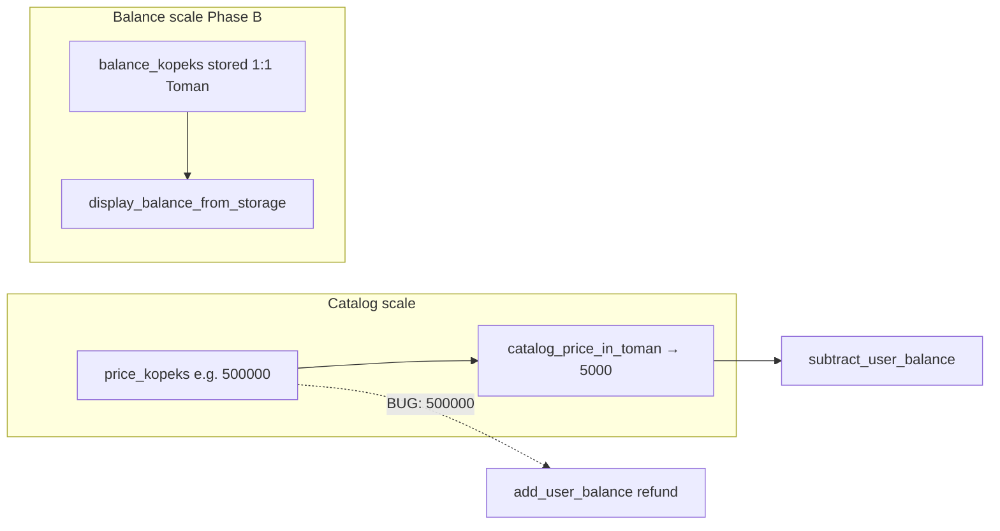

# Fix Toman Balance Unit Mismatches — Implementation Plan

> **For agentic workers:** REQUIRED SUB-SKILL: Use superpowers:subagent-driven-development (recommended) or superpowers:executing-plans to implement this plan task-by-task. Steps use checkbox (`- [ ]`) syntax for tracking.

**Goal:** Fix three production balance bugs where charge/refund/display paths mix catalog kopeks (÷100) with balance-scale Toman (1:1 storage).

**Architecture:** Follow existing Phase B conventions in `[app/utils/price_display.py](app/utils/price_display.py)`: `catalog_price_in_toman()` for subscription charges/refunds; `balance_from_display_amount()` / `display_balance_from_storage()` for balance movements and API `*_rubles` fields. No schema renames; no FX changes. One file (+ tests) per commit per `[delivery-cycle.mdc](.cursor/rules/delivery-cycle.mdc)`.

**Tech Stack:** Python 3, FastAPI cabinet routes, `pytest`, Docker smoke (`import main`).

**Branch:** `fix/toman-balance-units` from `main`

---

## Context: what broke



| Bug                   | File                                                                         | Charge / input                                       | Wrong output                  | Correct output                   |
| --------------------- | ---------------------------------------------------------------------------- | ---------------------------------------------------- | ----------------------------- | -------------------------------- |
| IntegrityError refund | `[purchase.py:877-968](app/cabinet/routes/subscription_modules/purchase.py)` | `catalog_price_in_toman(price_kopeks)`               | `price_kopeks` refund         | same Toman as charge             |
| Bulk add_balance      | `[admin_bulk_actions.py:400-438](app/cabinet/routes/admin_bulk_actions.py)`  | `_require_amount_kopeks()` resolves `amount_display` | `params.amount_kopeks` (None) | resolved Toman int               |
| Referral display      | `[referral.py:98-232](app/cabinet/routes/referral.py)`                       | `ReferralEarning.amount_kopeks` stored as Toman      | `total_earnings / 100`        | `display_balance_from_storage()` |

**Out of scope (separate follow-up):** `[withdrawal.py:126](app/cabinet/routes/withdrawal.py)` uses same `/100` pattern; referral `/terms` settings (`REFERRAL_MINIMUM_TOPUP_KOPEKS`) stay on catalog scale — keep `/100` there.

---

## File map

| File                                                                                                         | Action                                                               |
| ------------------------------------------------------------------------------------------------------------ | -------------------------------------------------------------------- |
| `[app/cabinet/routes/subscription_modules/purchase.py](app/cabinet/routes/subscription_modules/purchase.py)` | Introduce `charge_toman`; reuse in subtract + IntegrityError refund  |
| `[tests/cabinet/test_purchase_integrity_refund.py](tests/cabinet/test_purchase_integrity_refund.py)`         | **Create** — regression test for refund amount                       |
| `[app/cabinet/routes/admin_bulk_actions.py](app/cabinet/routes/admin_bulk_actions.py)`                       | `_do_add_balance` calls `_require_amount_kopeks(params)`             |
| `[tests/cabinet/test_bulk_add_balance_display.py](tests/cabinet/test_bulk_add_balance_display.py)`           | **Create** — `amount_display` path test                              |
| `[app/cabinet/routes/referral.py](app/cabinet/routes/referral.py)`                                           | Fix all balance-scale `*_rubles` fields in info + earnings endpoints |
| `[tests/cabinet/test_referral_display_units.py](tests/cabinet/test_referral_display_units.py)`               | **Create** — display unit parity test                                |

---

## Prerequisites

- [x] **Step 1:** Branch from `main`

```bash
git checkout main
git checkout -b fix/toman-balance-units
```

- [x] **Step 2:** Baseline smoke

```bash
docker compose run --rm --no-deps bot python -c "import main"
```

Expected: exit 0, no import errors.

---

### Task 1: Cabinet purchase IntegrityError refund parity

**Files:**

- Modify: `[app/cabinet/routes/subscription_modules/purchase.py](app/cabinet/routes/subscription_modules/purchase.py)` (~877-968)
- Create: `[tests/cabinet/test_purchase_integrity_refund.py](tests/cabinet/test_purchase_integrity_refund.py)`

Implemented: `charge_toman = catalog_price_in_toman(price_kopeks)` shared by subtract and IntegrityError refund.

Commit: `fix(cabinet): refund IntegrityError purchase in charged Toman units`

---

### Task 2: Admin bulk add_balance respects amount_display

**Files:**

- Modify: `[app/cabinet/routes/admin_bulk_actions.py](app/cabinet/routes/admin_bulk_actions.py)` (~400-438)
- Create: `[tests/cabinet/test_bulk_add_balance_display.py](tests/cabinet/test_bulk_add_balance_display.py)`

Implemented: `_do_add_balance` calls `_require_amount_kopeks(params)`.

Commit: `fix(cabinet): bulk add_balance use resolved amount_display`

---

### Task 3: Referral API display unit parity

**Files:**

- Modify: `[app/cabinet/routes/referral.py](app/cabinet/routes/referral.py)` (lines 98-108, 213-232)
- Create: `[tests/cabinet/test_referral_display_units.py](tests/cabinet/test_referral_display_units.py)`

Implemented: `display_balance_from_storage()` for info + earnings `*_rubles` fields; `/terms` unchanged.

Commit: `fix(cabinet): referral earnings rubles use balance-scale display`

---

## Post-implementation checklist

- [ ] Push branch: `git push -u remnabot fix/toman-balance-units` (only when user approves)
- [ ] User smoke:
  - Cabinet purchase duplicate-tariff conflict → balance unchanged after refund
  - Admin bulk add_balance with `amount_display` only → balance increases
  - Cabinet Referral page → total earnings matches available balance scale
- [x] Update `[.cursor/rules/fa-i18n-status.mdc](.cursor/rules/fa-i18n-status.mdc)` Done section

---

## Self-review (spec coverage)

| Requirement                                | Task                                  |
| ------------------------------------------ | ------------------------------------- |
| IntegrityError refund 100× bug             | Task 1                                |
| Bulk amount_display ignored                | Task 2                                |
| Referral total vs available scale mismatch | Task 3 (+ earnings list in same file) |
| No FX / no schema renames                  | All tasks                             |
| One concern per commit                     | 3 commits                             |
