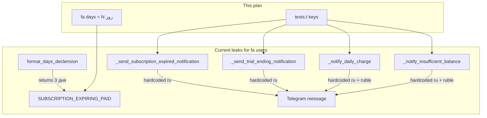

# fa Monitoring Notifications Implementation Plan

> **For agentic workers:** REQUIRED SUB-SKILL: Use superpowers:subagent-driven-development (recommended) or superpowers:executing-plans to implement this plan task-by-task. Steps use checkbox (`- [ ]`) syntax for tracking.

**Goal:** Eliminate Russian strings in scheduled user notifications (Telegram) for `language=fa` — especially mixed messages like «اشتراک تا 3 дня دیگر منقضی می‌شود».

**Architecture:** Locale-first: fix the shared helper `[app/utils/formatters.py](app/utils/formatters.py)` so `{days_text}` is Persian for `fa`; add missing user keys to `[app/localization/locales/fa.json](app/localization/locales/fa.json)` only; replace hardcoded Cyrillic f-strings in `[app/services/monitoring_service.py](app/services/monitoring_service.py)` and `[app/services/daily_subscription_service.py](app/services/daily_subscription_service.py)` with `get_texts(user.language).t('KEY', 'ru fallback')`. Use `texts.format_price` / `texts.format_balance` for amounts (layer 2 toman). One concern per commit per `[localization-upstream.mdc](.cursor/rules/localization-upstream.mdc)`.

**Tech Stack:** Python 3, pytest, aiogram, `fa.json`, Docker smoke (`import main`).

**Out of scope:** Email templates (`[app/cabinet/services/email_templates.py](app/cabinet/services/email_templates.py)` — still ru/en), cabinet WebSocket toasts (already Persian in `[cabinet/src/locales/fa.json](cabinet/src/locales/fa.json)`), RemnaWave webhook paths (already keyed).

**Branch:** `i18n/monitoring-notifications` from `main`

**Living status:** update `[.cursor/rules/fa-i18n-status.mdc](.cursor/rules/fa-i18n-status.mdc)` after last task.

---

## Root cause map



| Symptom                                 | File                                    | Fix                             |
| --------------------------------------- | --------------------------------------- | ------------------------------- |
| `3 дня` inside Persian expiry text      | `formatters.py:89-98`                   | Persian `{days} روز` branch     |
| Full Russian expired push               | `monitoring_service.py:1636-1651`       | `SUBSCRIPTION_EXPIRED_NOTIFY`   |
| Full Russian trial-ending push          | `monitoring_service.py:1800-1817`       | `TRIAL_ENDING_SOON` + `{price}` |
| Russian daily debit / suspend           | `daily_subscription_service.py:323-393` | new `NOTIFY_DAILY_*` keys       |
| Russian keyboard labels in autopay-fail | `monitoring_service.py:2167-2168`       | `texts.t('BTN_*')`              |

**Already OK (no code change):** `_send_subscription_expiring_notification` (uses `SUBSCRIPTION_EXPIRING_PAID`), `_check_traffic_warnings` (`TRAFFIC_WARNING_ALERT`), `_send_expired_day1_notification` (`SUBSCRIPTION_EXPIRED_1D`), RemnaWave webhook expiry/traffic keys.

---

## File map

| File                                                                                       | Responsibility                                                      |
| ------------------------------------------------------------------------------------------ | ------------------------------------------------------------------- |
| `[app/utils/formatters.py](app/utils/formatters.py)`                                       | `format_days_declension` — add `fa` branch                          |
| `[tests/utils/test_formatters_basic.py](tests/utils/test_formatters_basic.py)`             | Flip fa test from ru-fallback to Persian                            |
| `[app/localization/locales/fa.json](app/localization/locales/fa.json)`                     | New/updated notification keys                                       |
| `[app/services/monitoring_service.py](app/services/monitoring_service.py)`                 | Expired, trial, autopay keyboard/tariff suffix                      |
| `[app/services/daily_subscription_service.py](app/services/daily_subscription_service.py)` | Daily charge + insufficient funds                                   |
| `[tests/test_monitoring_notification_i18n.py](tests/test_monitoring_notification_i18n.py)` | **Create** — static guard against bare Cyrillic notification bodies |
| `[.cursor/rules/fa-i18n-status.mdc](.cursor/rules/fa-i18n-status.mdc)`                     | Done/Next append                                                    |

---

### Task 1: Persian `format_days_declension` (fixes mixed expiry text)

**Files:**

- Modify: `[app/utils/formatters.py](app/utils/formatters.py:89-98)`
- Modify: `[tests/utils/test_formatters_basic.py](tests/utils/test_formatters_basic.py:34-37)`

- [ ] **Step 1: Update failing test**

Replace `test_format_days_declension_uses_russian_fallback_for_fa` with:

```python
def test_format_days_declension_uses_persian_for_fa() -> None:
    """Persian has no Russian-style declension — always N روز."""
    assert formatters.format_days_declension(1, language='fa') == '1 روز'
    assert formatters.format_days_declension(3, language='fa') == '3 روز'
    assert formatters.format_days_declension(10, language='fa') == '10 روز'
```

- [ ] **Step 2: Run test — verify FAIL**

```bash
cd /opt/bot-remnawave
docker compose run --rm --no-deps bot python -m pytest tests/utils/test_formatters_basic.py::test_format_days_declension_uses_persian_for_fa -v
```

Expected: FAIL — `'3 дня' != '3 روز'`

- [ ] **Step 3: Implement fa branch**

In `format_days_declension`, after `language_code` normalization, insert before Russian rules:

```python
    if language_code == 'fa':
        return f'{days} روز'
```

Keep existing `ru` declension unchanged.

- [ ] **Step 4: Run tests — verify PASS**

```bash
docker compose run --rm --no-deps bot python -m pytest tests/utils/test_formatters_basic.py -v
```

Expected: all PASS

- [ ] **Step 5: Commit**

```bash
git add app/utils/formatters.py tests/utils/test_formatters_basic.py
git commit -m "fix(i18n): Persian day count in format_days_declension for fa"
```

---

### Task 2: fa.json keys for monitoring + daily notifications

**Files:**

- Modify: `[app/localization/locales/fa.json](app/localization/locales/fa.json)`

Add keys (Persian values; Cyrillic only in code fallbacks, not JSON):

| Key                               | Persian value                                                                                                                                                               |
| --------------------------------- | --------------------------------------------------------------------------------------------------------------------------------------------------------------------------- |
| `SUBSCRIPTION_EXPIRED_NOTIFY`     | `⛔ <b>اشتراک{tariff_label} منقضی شد</b>\n\nاشتراک شما منقضی شده است. برای بازگرداندن دسترسی تمدید کنید.\n\n🔧 دسترسی به سرورها تا زمان تمدید مسدود است.`                    |
| `NOTIFY_TARIFF_LINE`              | `\n📦 سرویس: «{name}»`                                                                                                                                                      |
| `NOTIFY_DAILY_DEBIT`              | `💳 <b>کسر روزانه</b>\n\nکسر شد: {amount}\nموجودی باقی‌مانده: {balance}{tariff_line}\n\nکسر بعدی ۲۴ ساعت دیگر.`                                                             |
| `NOTIFY_DAILY_INSUFFICIENT_FUNDS` | `⚠️ <b>اشتراک{tariff_label} متوقف شد</b>\n\nموجودی برای پرداخت روزانه کافی نیست.\n\nمورد نیاز: {required}\nموجودی: {balance}\n\nبرای از سرگیری اشتراک موجودی را شارژ کنید.` |

Also align existing `SUBSCRIPTION_EXPIRED` in fa.json with ru.json structure (add `{tariff_label}` support is **not** needed if `SUBSCRIPTION_EXPIRED_NOTIFY` covers monitoring path).

- [ ] **Step 1: Add keys to fa.json**

- [ ] **Step 2: Agent smoke**

```bash
docker compose run --rm --no-deps bot python -c "import main"
cp app/localization/locales/fa.json ./locales/fa.json
```

Expected: exit 0, no `KeyError`

- [ ] **Step 3: Commit**

```bash
git add app/localization/locales/fa.json
git commit -m "i18n(fa): add monitoring and daily notification keys"
```

---

### Task 3: Wire `monitoring_service.py` notification builders

**Files:**

- Modify: `[app/services/monitoring_service.py](app/services/monitoring_service.py:1626-1825, 2147-2170)`

- [ ] **Step 1: `_send_subscription_expired_notification`**

Replace hardcoded `message = f"""..."""` with:

```python
texts = get_texts(user.language)
tariff_label = ''  # existing logic
message = texts.t(
    'SUBSCRIPTION_EXPIRED_NOTIFY',
    '⛔ <b>Подписка{tariff_label} истекла</b>\n\n'
    'Ваша подписка истекла. Для восстановления доступа продлите подписку.\n\n'
    '🔧 Доступ к серверам заблокирован до продления.',
).format(tariff_label=tariff_label)
```

Keyboard buttons:

```python
build_miniapp_or_callback_button(
    text=texts.t('SUBSCRIPTION_EXTEND', '💎 Продлить подписку'),
    callback_data=extend_callback,
)
build_miniapp_or_callback_button(
    text=texts.t('BALANCE_TOPUP', '💳 Пополнить баланс'),
    callback_data='balance_topup',
)
```

- [ ] **Step 2: `_send_trial_ending_notification`**

```python
texts = get_texts(user.language)
price = settings.format_price(settings.PRICE_30_DAYS)
message = texts.t(
    'TRIAL_ENDING_SOON',
    '\n🎁 <b>Тестовая подписка скоро закончится!</b>\n\n...',
).format(price=price, tariff_label=tariff_label)
```

Note: `TRIAL_ENDING_SOON` template uses `{tariff_label}` only if added to fa.json — if not in template, keep tariff_label in a separate `NOTIFY_TARIFF_LINE` append or add `{tariff_label}` to the Persian key body after `آزمایشی`.

Keyboard:

```python
text=texts.t('MENU_BUY_SUBSCRIPTION', '💎 Купить подписку')  # callback menu_buy
text=texts.t('BALANCE_TOPUP', '💰 Пополнить баланс')
```

- [ ] **Step 3: `_send_autopay_failed_notification` tariff suffix + keyboard**

Replace:

```python
message += f'\n📦 Тариф: «{subscription.tariff.name}»'
```

with:

```python
message += texts.t('NOTIFY_TARIFF_LINE', '\n📦 Тариф: «{name}»').format(
    name=subscription.tariff.name
)
```

Keyboard buttons via `texts.t('BTN_TOPUP_BALANCE', ...)` and `texts.t('BTN_MY_SUBSCRIPTION' / 'BTN_MY_SUBSCRIPTIONS', ...)`.

- [ ] **Step 4: Agent smoke**

```bash
docker compose run --rm --no-deps bot python -c "import main"
```

- [ ] **Step 5: Commit**

```bash
git add app/services/monitoring_service.py
git commit -m "i18n(fa): localize monitoring expiry and trial notifications"
```

---

### Task 4: Wire `daily_subscription_service.py` user notifications

**Files:**

- Modify: `[app/services/daily_subscription_service.py](app/services/daily_subscription_service.py:323-393)`

- [ ] **Step 1: `_notify_daily_charge`**

```python
texts = get_texts(getattr(user, 'language', 'ru'))
tariff_line = ''
if settings.is_multi_tariff_enabled() and subscription.tariff:
    tariff_line = texts.t('NOTIFY_TARIFF_LINE', '\n📦 Тариф: «{name}»').format(
        name=subscription.tariff.name
    )
message = texts.t(
    'NOTIFY_DAILY_DEBIT',
    '💳 <b>Суточное списание</b>\n\n'
    'Списано: {amount}\n'
    'Остаток баланса: {balance}{tariff_line}\n\n'
    'Следующее списание через 24 часа.',
).format(
    amount=texts.format_price(amount_kopeks),
    balance=texts.format_balance(user.balance_kopeks),
    tariff_line=tariff_line,
)
```

Remove `amount_rubles / 100` and `₽` literals.

- [ ] **Step 2: `_notify_insufficient_balance`**

Same pattern with `NOTIFY_DAILY_INSUFFICIENT_FUNDS`; keyboard via `texts.t('BTN_TOPUP_BALANCE')` and `texts.t('BTN_MY_SUBSCRIPTION')`.

Update `context` dict to use `texts.format_price` / `texts.format_balance` instead of `₽` strings.

- [ ] **Step 3: Agent smoke + commit**

```bash
docker compose run --rm --no-deps bot python -c "import main"
git add app/services/daily_subscription_service.py
git commit -m "i18n(fa): localize daily subscription user notifications"
```

---

### Task 5: Static regression guard

**Files:**

- Create: `[tests/test_monitoring_notification_i18n.py](tests/test_monitoring_notification_i18n.py)`

- [ ] **Step 1: Write guard test** (pattern mirrors `[tests/test_restriction_fallback.py](tests/test_restriction_fallback.py)`)

```python
"""Scheduled user notifications must not use bare Cyrillic message bodies."""

import re
from pathlib import Path

APP = Path(__file__).resolve().parents[1] / 'app'
TARGETS = [
    APP / 'services' / 'monitoring_service.py',
    APP / 'services' / 'daily_subscription_service.py',
]
# f-string message bodies with Cyrillic — not texts.t fallbacks
BARE_MSG = re.compile(
    r"message\s*=\s*f['\"]{3}.*[А-Яа-яЁё]",
    re.DOTALL,
)
BARE_F = re.compile(
    r"message\s*=\s*\(\s*f['\"].*[А-Яа-яЁё]",
)


def test_no_bare_cyrillic_notification_bodies():
    offenders = []
    for path in TARGETS:
        text = path.read_text(encoding='utf-8')
        for i, line in enumerate(text.splitlines(), 1):
            if 'texts.t(' in line:
                continue
            if BARE_F.search(line) or (
                'message = f"""' in line or "message = f'''" in line
            ):
                # flag only if block contains Cyrillic — scan next 15 lines
                block = '\n'.join(text.splitlines()[i - 1 : i + 14])
                if '[А-Яа-яЁё]' and __import__('re').search(r'[А-Яа-яЁё]', block):
                    if 'texts.t(' not in block:
                        offenders.append(f'{path.relative_to(APP.parent)}:{i}')
    assert not offenders, 'Bare Cyrillic notification bodies:\n' + '\n'.join(offenders)
```

- [ ] **Step 2: Run test — verify PASS** (after Tasks 3–4)

```bash
docker compose run --rm --no-deps bot python -m pytest tests/test_monitoring_notification_i18n.py -v
```

- [ ] **Step 3: Commit**

```bash
git add tests/test_monitoring_notification_i18n.py
git commit -m "test(i18n): guard against bare Cyrillic monitoring notifications"
```

---

### Task 6: Update living status

**Files:**

- Modify: `[.cursor/rules/fa-i18n-status.mdc](.cursor/rules/fa-i18n-status.mdc)`

- [ ] Append Done section: monitoring notifications slice (formatter, monitoring_service, daily_subscription_service, keys, test).
- [ ] Commit: `docs(i18n): log monitoring notification localization`

---

## Final smoke checklist

```bash
docker compose run --rm --no-deps bot python -m pytest \
  tests/utils/test_formatters_basic.py \
  tests/test_monitoring_notification_i18n.py \
  tests/test_restriction_fallback.py -v
docker compose run --rm --no-deps bot python -c "import main"
cp app/localization/locales/fa.json ./locales/fa.json
docker compose restart bot
grep -r get_admin_texts app/   # must be 0
```

**Manual smoke (fa Telegram user):**

1. Trigger or simulate expiring notification (3 days left) — body fully Persian, no `дня`/`дней`
2. Let subscription expire — expired push in Persian (not `Подписка истекла`)
3. Trial ending (2h) — Persian body with price in تومان
4. Daily tariff: daily debit + insufficient-balance suspend — Persian, تومان amounts

---

## Self-review

| Requirement                                | Task                                        |
| ------------------------------------------ | ------------------------------------------- |
| Mixed `3 дня` in expiry text               | Task 1                                      |
| Hardcoded expired notification             | Task 2–3                                    |
| Hardcoded trial notification               | Task 2–3                                    |
| Daily charge/suspend Russian               | Task 2–4                                    |
| Autopay-fail keyboard/tariff leak          | Task 3                                      |
| TDD / regression                           | Tasks 1, 5                                  |
| One file per commit rule                   | Tasks 1, 3, 4 separate; Task 2 fa.json only |
| Email i18n                                 | Out of scope                                |
| Traffic webhook/monitoring TRAFFIC_WARNING | Already keyed — no task                     |

**Placeholder scan:** All keys, code patterns, and commands specified — no TBD.

---

## Execution handoff

**Plan will be saved to** `docs/superpowers/plans/2026-06-16-fa-monitoring-notifications.md` on approval.

**Two execution options:**

1. **Subagent-Driven (recommended)** — fresh subagent per task, review between tasks
2. **Inline Execution** — execute tasks sequentially in one session with checkpoints
