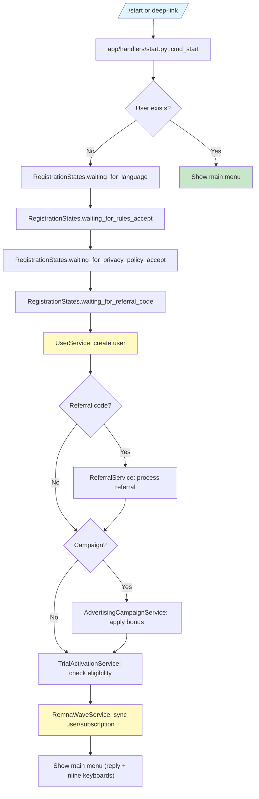
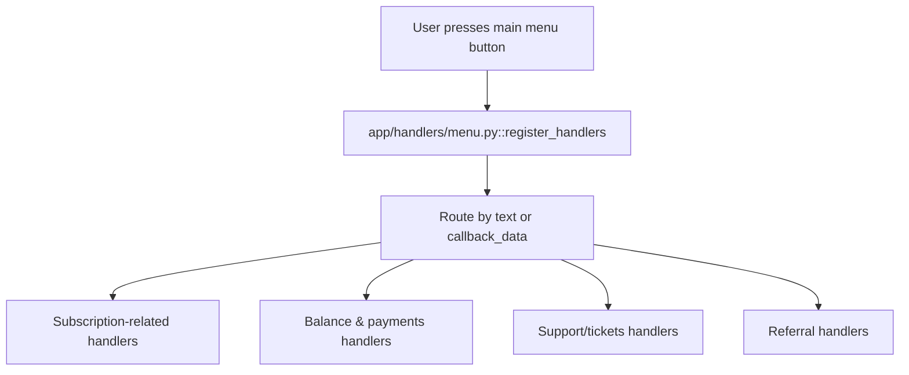
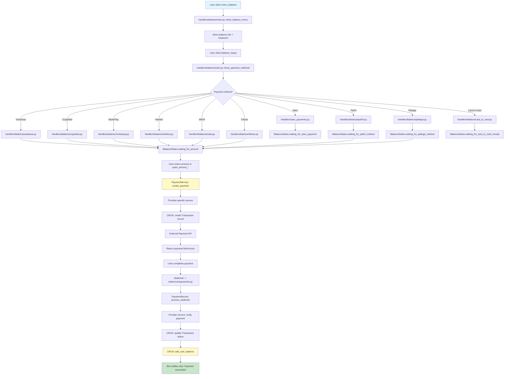
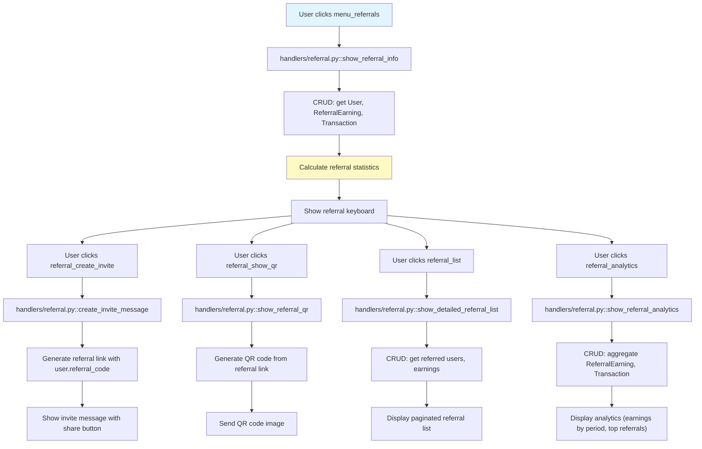
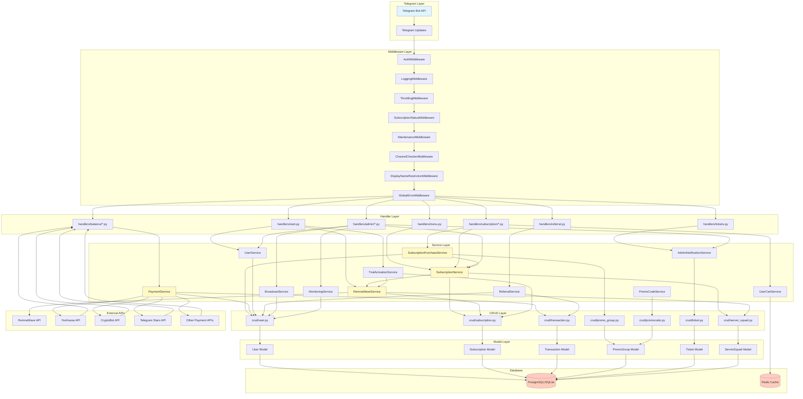
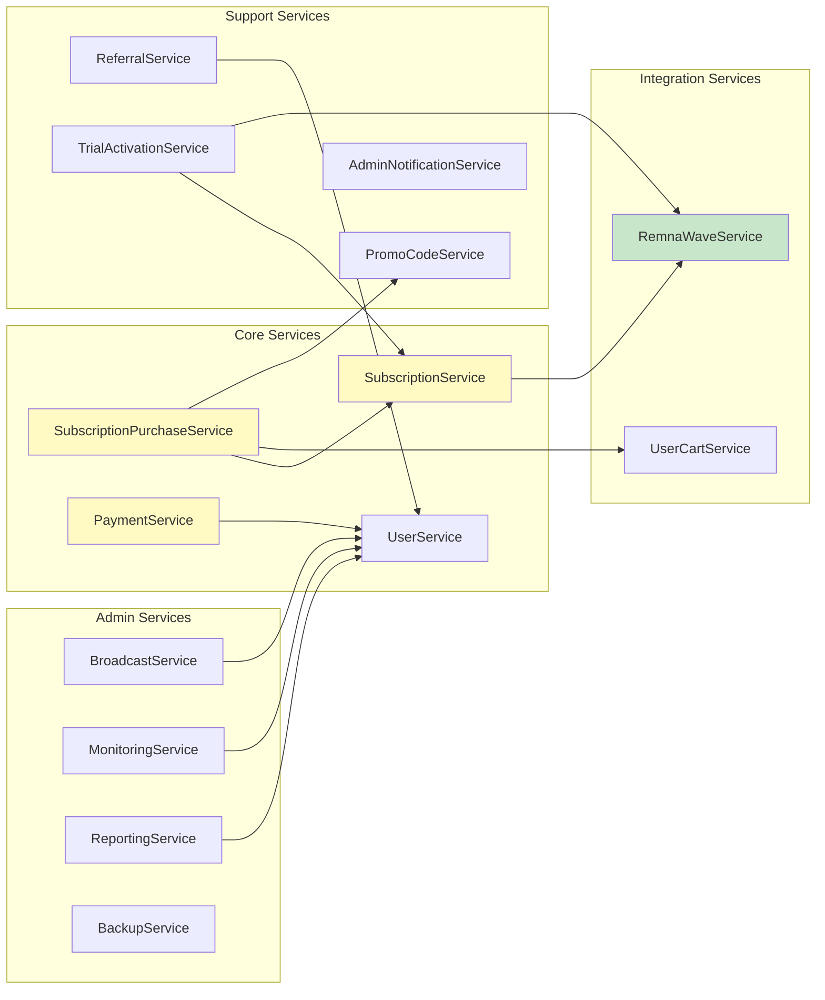

# Telegram Feature Flows (End‑to‑End)

This document maps **end‑to‑end flows** for major bot capabilities:

- Trigger (command/button)
- FSM states (if any)
- Handlers (modules/functions)
- Services (business logic)
- Database/CRUD and external APIs
- Outgoing replies and keyboards

It is organized by **feature buckets** defined in `docs/telegram-flows-overview.md`.

---

## 1. Registration & Onboarding

### 1.1. High-Level Flow



Planned table structure:

| Step                | Component                                 | Notes                                        |
|---------------------|-------------------------------------------|----------------------------------------------|
| Trigger             | `/start`, deep-link, start button         | From Telegram                                |
| Handler             | `app/handlers/start.py`                   | Registers `/start` and related handlers      |
| FSM                 | `RegistrationStates`                      | State per step in onboarding                 |
| Services            | `UserService`, `SubscriptionService`, `TrialActivationService`, `RemnaWaveService` | User + subscription bootstrap  |
| Data                | `User`, `Subscription`, `SubscriptionTemporaryAccess`, etc. | From `app/database/models.py` |
| Keyboards           | `get_language_selection_keyboard`, `get_main_reply_keyboard` | From `app/keyboards/*`          |

Concrete handler/service/mapping details will be filled from code.

---

## 2. Main Menu & Navigation

Entry points and navigation between sections (subscriptions, balance, support, referral, etc.)
are driven by:

- Reply keyboard: `get_main_reply_keyboard()`.
- Inline keyboard: `get_main_menu_keyboard()`, `get_info_menu_keyboard()` and others.

High-level flow:



Detailed per-button mappings are in `docs/telegram-keyboards-map.md`.

---

## 3. Subscription Purchase & Management

This bucket contains the most complex flows. It spans:

- `app/handlers/subscription/*.py`
- `SubscriptionService`, `SubscriptionPurchaseService`, `UserCartService`, etc.
- `Purchase*` Pydantic models and miniapp‑related logic in `app/webapi/routes/miniapp.py`.

### 3.1. Complete Purchase Flow Diagram

```mermaid
flowchart TD
  entry["User clicks menu_buy or subscription_purchase"]
    --> purchaseHandler["handlers/subscription/purchase.py::start_subscription_purchase"]
  purchaseHandler --> checkCart{Has saved cart?}
  checkCart -->|Yes| loadCart["UserCartService: load cart from Redis"]
  checkCart -->|No| periodState["SubscriptionStates.selecting_period"]
  loadCart --> periodState
  
  periodState --> periodHandler["purchase.py::select_period"]
  periodHandler --> purchaseService1["SubscriptionPurchaseService: build options"]
  purchaseService1 --> promoService1["Get user PromoGroup for discounts"]
  promoService1 --> trafficState["SubscriptionStates.selecting_traffic"]
  
  trafficState --> trafficHandler["purchase.py::select_traffic"]
  trafficHandler --> purchaseService2["SubscriptionPurchaseService: calculate pricing"]
  purchaseService2 --> countriesState["SubscriptionStates.selecting_countries"]
  
  countriesState --> countriesHandler["countries.py handlers"]
  countriesHandler --> remnawaveService1["RemnaWaveService: get available servers"]
  remnawaveService1 --> devicesState["SubscriptionStates.selecting_devices"]
  
  devicesState --> devicesHandler["devices.py::select_devices"]
  devicesHandler --> purchaseService3["SubscriptionPurchaseService: finalize config"]
  purchaseService3 --> confirmState["SubscriptionStates.confirming_purchase"]
  
  confirmState --> confirmHandler["purchase.py::confirm_purchase"]
  confirmHandler --> validateService["SubscriptionPurchaseService: validate purchase"]
  validateService --> checkBalance{Balance sufficient?}
  
  checkBalance -->|No| paymentFlow["PaymentService: create payment"]
  checkBalance -->|Yes| createSub["SubscriptionService: create/update subscription"]
  
  paymentFlow --> paymentProvider[Payment Provider API]
  paymentProvider --> webhook["Webhook: payment confirmation"]
  webhook --> createSub
  
  createSub --> remnawaveService2["RemnaWaveService: sync subscription"]
  remnawaveService2 --> dbOps["CRUD: Subscription, Transaction, SubscriptionServer"]
  dbOps --> clearCart["UserCartService: clear cart"]
  clearCart --> reply["Confirmation message + connection info"]
  
  style entry fill:#e1f5ff
  style reply fill:#c8e6c9
  style createSub fill:#fff9c4
  style remnawaveService2 fill:#fff9c4
```



This section will be expanded into tables:

- `/subscription entry` triggers (buttons/commands).
- FSM states in `SubscriptionStates`.
- Handler modules and functions.
- Services and models used (including promo groups, offers, discounts).

---

## 4. Balance & Payments

Payment flows are split between:

- `app/handlers/balance.py` and `app/handlers/balance/*.py`
- `PaymentService` and provider‑specific services under `app/services/payment/*.py`
- External clients in `app/external/*` and webhooks in `app/webserver/payments.py`.

### 4.1. Complete Payment Flow Diagram



Details of each provider (callbacks, statuses, error handling) are documented at the service
and external client level; here we focus on the Telegram entry points and flows.

---

## 5. Support & Tickets

Support and ticketing involves:

- User side: `app/handlers/support.py`, `app/handlers/tickets.py`.
- Admin side: `app/handlers/admin/tickets.py`, `SupportSettingsStates`, etc.
- Services: `SupportSettingsService`, `AdminNotificationService`, ticket CRUD.

### 5.1. Complete Ticket Flow Diagram

```mermaid
flowchart TD
  supportBtn["User clicks menu_support"]
    --> supportHandler["handlers/support.py::show_support_info"]
  supportHandler --> supportService["SupportSettingsService: get support info"]
  supportService --> supportKeyboard["Show support keyboard"]
  
  supportKeyboard --> createTicketBtn["User clicks create_ticket"]
  createTicketBtn --> ticketHandler1["handlers/tickets.py::create_ticket"]
  ticketHandler1 --> titleState["TicketStates.waiting_for_title"]
  
  titleState --> titleInput["User enters ticket title"]
  titleInput --> ticketHandler2["handlers/tickets.py::process_ticket_title"]
  ticketHandler2 --> messageState["TicketStates.waiting_for_message"]
  
  messageState --> messageInput["User enters ticket message"]
  messageInput --> ticketHandler3["handlers/tickets.py::process_ticket_message"]
  ticketHandler3 --> createTicket["CRUD: create Ticket, TicketMessage"]
  createTicket --> notifyService["AdminNotificationService: notify admins"]
  notifyService --> ticketCreated["Ticket created, user notified"]
  
  ticketCreated --> adminView["Admin views ticket via admin_tickets"]
  adminView --> adminReplyBtn["Admin clicks admin_ticket_reply:*"]
  adminReplyBtn --> adminReplyState["AdminTicketStates.waiting_for_reply"]
  adminReplyState --> adminReplyInput["Admin enters reply"]
  adminReplyInput --> adminReplyHandler["handlers/admin/tickets.py::process_admin_reply"]
  adminReplyHandler --> createAdminMessage["CRUD: create TicketMessage"]
  createAdminMessage --> notifyUserService["AdminNotificationService: notify user"]
  notifyUserService --> userSeesReply["User sees admin reply"]
  
  style supportBtn fill:#e1f5ff
  style ticketCreated fill:#c8e6c9
  style userSeesReply fill:#c8e6c9
  style notifyService fill:#fff9c4
```



---

## 6. Referral Program

Referral features use:

- `app/handlers/referral.py`
- `ReferralService` and related models.
- Inline buttons for referral stats and links.

### 6.1. Referral Flow Diagram



---

## 7. Admin Panel Flows (Summary)

Admin panel is large and includes:

- `app/handlers/admin/*.py`
- `app/keyboards/admin.py` reply keyboards
- Dozens of services and CRUD modules.

Rather than documenting every micro‑step here, this section will:

- Provide an overview of major admin sections (Users, Subscriptions, Promo, Campaigns, Monitoring, Servers, Pricing, Rules, Logs, etc.).
- Show how admin entry points (admin start, admin main menu keyboard) route into specific handler modules.
- Link to FSMs and keyboards where applicable.

---

## 8. Dependency Tables

### 8.1. Registration & Onboarding

| Feature                | Trigger (cmd/button)     | Handler(s)                          | Services                                | Models/CRUD                      | External APIs                    |
|------------------------|--------------------------|--------------------------------------|-----------------------------------------|----------------------------------|----------------------------------|
| Registration           | `/start`                 | `handlers/start.py`                 | `UserService`, `SubscriptionService`, `TrialActivationService`, `RemnaWaveService`, `AdvertisingCampaignService` | `User`, `Subscription`, `SubscriptionTemporaryAccess`, `AdvertisingCampaignRegistration` | RemnaWave API |
| Language Selection     | `language_select:*`      | `handlers/start.py`                 | `UserService`                            | `User`                           | None                             |
| Rules Acceptance       | `rules_accept`           | `handlers/start.py`                 | None (direct CRUD)                       | `User`                           | None                             |
| Privacy Policy Accept  | `privacy_policy_accept`  | `handlers/start.py`                 | `PrivacyPolicyService`                   | `User`, `PrivacyPolicy`          | None                             |
| Referral Code Input    | Text input / `referral_skip` | `handlers/start.py`              | `ReferralService`                        | `User`, `ReferralEarning`        | None                             |
| Channel Subscription   | `sub_channel_check`      | `handlers/start.py`                 | None (Telegram API check)                | None                             | Telegram Bot API                 |
| Trial Activation       | `trial_activate`         | `handlers/subscription/purchase.py` | `TrialActivationService`, `SubscriptionService`, `RemnaWaveService` | `Subscription`, `SubscriptionTemporaryAccess` | RemnaWave API |

### 8.2. Subscription Purchase & Management

| Feature                | Trigger (cmd/button)     | Handler(s)                          | Services                                | Models/CRUD                      | External APIs                    |
|------------------------|--------------------------|--------------------------------------|-----------------------------------------|----------------------------------|----------------------------------|
| Subscription Purchase  | `menu_buy`, `subscription_purchase` | `handlers/subscription/purchase.py` | `SubscriptionPurchaseService`, `SubscriptionService`, `UserCartService`, `PaymentService`, `PromoCodeService` | `Subscription`, `Transaction`, `User`, `PromoCodeUse`, `PromoGroup` | RemnaWave API |
| Period Selection       | `period_*`               | `handlers/subscription/purchase.py` | `SubscriptionPurchaseService`           | None (FSM state only)            | None                             |
| Traffic Selection      | `traffic_*`              | `handlers/subscription/purchase.py` | `SubscriptionPurchaseService`           | None (FSM state only)            | None                             |
| Country Selection       | Country callbacks        | `handlers/subscription/countries.py` | `SubscriptionPurchaseService`, `SubscriptionService` | `ServerSquad`, `SubscriptionServer` | RemnaWave API |
| Device Selection        | `devices_*`              | `handlers/subscription/devices.py`  | `SubscriptionPurchaseService`           | None (FSM state only)            | None                             |
| Purchase Confirmation   | `subscription_confirm`   | `handlers/subscription/purchase.py` | `SubscriptionPurchaseService`, `SubscriptionService`, `PaymentService`, `RemnaWaveService` | `Subscription`, `Transaction`, `User`, `SubscriptionServer` | RemnaWave API |
| Add Countries           | `subscription_add_countries` | `handlers/subscription/purchase.py` | `SubscriptionService`                   | `Subscription`, `SubscriptionServer`, `ServerSquad` | RemnaWave API |
| Change Devices          | `subscription_change_devices` | `handlers/subscription/purchase.py` | `SubscriptionService`                   | `Subscription`                   | RemnaWave API |
| Extend Subscription     | `subscription_extend`    | `handlers/subscription/purchase.py` | `SubscriptionService`, `PaymentService`  | `Subscription`, `Transaction`    | RemnaWave API |
| Reset Traffic           | `subscription_reset_traffic` | `handlers/subscription/purchase.py` | `SubscriptionService`                   | `Subscription`                   | RemnaWave API |
| Auto-pay Configuration  | `subscription_autopay`   | `handlers/subscription/autopay.py`  | `SubscriptionService`                   | `Subscription`                   | None                             |
| Cart Management         | `return_to_saved_cart`, `clear_saved_cart` | `handlers/subscription/purchase.py` | `UserCartService`                        | Redis (cart state)               | None                             |
| Simple Subscription     | `simple_subscription_purchase` | `handlers/simple_subscription.py` | `SubscriptionPurchaseService`, `PaymentService` | `Subscription`, `Transaction`    | RemnaWave API |

### 8.3. Balance & Payments

| Feature                | Trigger (cmd/button)     | Handler(s)                          | Services                                | Models/CRUD                      | External APIs                    |
|------------------------|--------------------------|--------------------------------------|-----------------------------------------|----------------------------------|----------------------------------|
| Balance Top-Up         | `menu_balance`, `balance_topup` | `handlers/balance/main.py`         | `PaymentService`                        | `User`, `Transaction`            | None (routes to provider handlers) |
| YooKassa Payment       | `topup_yookassa`         | `handlers/balance/yookassa.py`      | `PaymentService`, `YooKassaService`     | `Transaction`, `YooKassaPayment` | YooKassa API, Webhook |
| CryptoBot Payment      | `topup_cryptobot`        | `handlers/balance/cryptobot.py`    | `PaymentService`, `CryptoBotService`     | `Transaction`, `CryptoBotPayment` | CryptoBot API, Webhook |
| Telegram Stars Payment | `topup_stars`            | `handlers/stars_payments.py`        | `PaymentService`, `TelegramStarsService` | `Transaction`                    | Telegram Bot API |
| MulenPay Payment       | `topup_mulenpay`         | `handlers/balance/mulenpay.py`     | `PaymentService`, `MulenPayService`      | `Transaction`, `MulenPayPayment` | MulenPay API, Webhook |
| Pal24 Payment          | `topup_pal24`            | `handlers/balance/pal24.py`         | `PaymentService`, `Pal24Service`         | `Transaction`, `Pal24Payment`    | Pal24 API, Webhook (Flask) |
| Heleket Payment        | `topup_heleket`          | `handlers/balance/heleket.py`       | `PaymentService`, `HeleketService`       | `Transaction`                    | Heleket API, Webhook |
| WATA Payment           | `topup_wata`             | `handlers/balance/wata.py`          | `PaymentService`                        | `Transaction`                    | WATA API, Webhook |
| Platega Payment        | `topup_platega`          | `handlers/balance/platega.py`       | `PaymentService`                         | `Transaction`                    | Platega API, Webhook |
| Tribute Payment        | `topup_tribute`          | `handlers/balance/tribute.py`       | `PaymentService`, `TributeService`      | `Transaction`                    | Tribute API, Webhook |
| Card-to-Card Payment   | `payment_card_to_card`   | `handlers/balance/card_to_card.py`  | `PaymentService`                        | `Transaction`                    | None (manual verification) |
| Quick Amount Selection  | `quick_amount_*`         | `handlers/balance/main.py`         | `PaymentService`                        | `User` (for discount calculation) | None |
| Payment Status Check   | `check_*_*`              | `handlers/balance/*.py`             | `PaymentService`, provider services      | `Transaction`                    | Provider APIs |

### 8.4. Support & Tickets

| Feature                | Trigger (cmd/button)     | Handler(s)                          | Services                                | Models/CRUD                      | External APIs                    |
|------------------------|--------------------------|--------------------------------------|-----------------------------------------|----------------------------------|----------------------------------|
| Support Info           | `menu_support`           | `handlers/support.py`               | `SupportSettingsService`                | None                             | None                             |
| Create Ticket          | `create_ticket`          | `handlers/tickets.py`                | `AdminNotificationService`, `SupportSettingsService` | `Ticket`, `TicketMessage` | None                             |
| View Tickets           | `my_tickets`             | `handlers/tickets.py`                | None (direct CRUD)                      | `Ticket`, `TicketMessage`         | None                             |
| Reply to Ticket        | `ticket_reply:*`         | `handlers/tickets.py`                | `AdminNotificationService`              | `Ticket`, `TicketMessage`         | None                             |
| Admin Ticket Reply     | `admin_ticket_reply:*`   | `handlers/admin/tickets.py`         | `AdminNotificationService`              | `Ticket`, `TicketMessage`         | None                             |

### 8.5. Referral Program

| Feature                | Trigger (cmd/button)     | Handler(s)                          | Services                                | Models/CRUD                      | External APIs                    |
|------------------------|--------------------------|--------------------------------------|-----------------------------------------|----------------------------------|----------------------------------|
| Referral Info          | `menu_referrals`         | `handlers/referral.py`               | None (direct CRUD)                      | `User`, `ReferralEarning`, `Transaction` | None |
| Create Invite          | `referral_create_invite` | `handlers/referral.py`              | None (direct CRUD)                      | `User`                           | None                             |
| Show QR Code           | `referral_show_qr`       | `handlers/referral.py`               | None (QR generation)                    | `User`                           | None                             |
| Referral List          | `referral_list`          | `handlers/referral.py`               | None (direct CRUD)                      | `User`, `ReferralEarning`        | None                             |
| Referral Analytics     | `referral_analytics`     | `handlers/referral.py`               | None (direct CRUD)                      | `User`, `ReferralEarning`, `Transaction` | None |

### 8.6. Promo Code Activation

| Feature                | Trigger (cmd/button)     | Handler(s)                          | Services                                | Models/CRUD                      | External APIs                    |
|------------------------|--------------------------|--------------------------------------|-----------------------------------------|----------------------------------|----------------------------------|
| Promo Code Input        | Text input (reply keyboard) | `handlers/promocode.py`          | `PromoCodeService`                       | `PromoCode`, `PromoCodeUse`, `User` | None |

### 8.7. Admin Panel (Selected Major Flows)

| Feature                | Trigger (cmd/button)     | Handler(s)                          | Services                                | Models/CRUD                      | External APIs                    |
|------------------------|--------------------------|--------------------------------------|-----------------------------------------|----------------------------------|----------------------------------|
| Admin Main Menu        | `admin_panel`            | `handlers/admin/main.py`             | None                                    | None                             | None                             |
| User Management        | `admin_users`            | `handlers/admin/users.py`            | `UserService`, `SubscriptionService`, `AdminNotificationService` | `User`, `Subscription`, `Transaction` | RemnaWave API |
| Subscription Management | `admin_subscriptions`    | `handlers/admin/subscriptions.py`   | `SubscriptionService`, `RemnaWaveService` | `Subscription`, `User`          | RemnaWave API |
| Promo Group Management | Admin promo menu         | `handlers/admin/promo_groups.py`     | `PromoGroupAssignment`, `SystemSettingsService` | `PromoGroup`, `User`      | None                             |
| Promo Code Management  | `admin_promocodes`       | `handlers/admin/promocodes.py`      | `PromoCodeService`                       | `PromoCode`, `PromoCodeUse`      | None                             |
| Campaign Management    | Admin campaign menu      | `handlers/admin/campaigns.py`        | `AdvertisingCampaignService`            | `AdvertisingCampaign`, `AdvertisingCampaignRegistration` | None |
| Broadcast Messages     | Admin messages menu      | `handlers/admin/messages.py`         | `BroadcastService`                      | `BroadcastHistory`, `SentNotification` | None |
| Monitoring             | `admin_monitoring`       | `handlers/admin/monitoring.py`      | `MonitoringService`, `NotificationSettingsService` | `MonitoringLog` | None |
| RemnaWave Management   | `admin_remnawave`        | `handlers/admin/remnawave.py`        | `RemnaWaveService`, `RemnaWaveSyncService` | `ServerSquad`, `SubscriptionServer` | RemnaWave API |
| Pricing Configuration  | Admin pricing menu       | `handlers/admin/pricing.py`          | `SystemSettingsService`                 | `SystemSetting`                  | None                             |
| Backup Management      | Admin backup menu        | `handlers/admin/backup.py`           | `BackupService`                         | Database backup files            | None                             |
| Reports                | Admin reports menu       | `handlers/admin/reports.py`          | `ReportingService`                      | Various models (aggregated)      | None                             |

## 9. Complete Dependency Chain Examples

### Example 1: Subscription Purchase Flow

```text
Button: `menu_buy` (inline)
  ↓
Handler: `handlers/subscription/purchase.py::start_subscription_purchase`
  ↓
State: `SubscriptionStates.selecting_period`
  ↓
Service: `SubscriptionPurchaseService::build_purchase_options`
  ↓
CRUD: `crud/promo_group.py::get_user_promo_groups`
  ↓
Model: `PromoGroup`, `User`
  ↓
Service: `SubscriptionService::calculate_price_with_discounts`
  ↓
External: RemnaWave API (for server availability)
  ↓
Reply: `get_subscription_period_keyboard()` with prices
```

### Example 2: Balance Top-Up via YooKassa

```text
Button: `topup_yookassa` (inline)
  ↓
Handler: `handlers/balance/yookassa.py::start_yookassa_payment`
  ↓
State: `BalanceStates.waiting_for_amount`
  ↓
Service: `PaymentService::create_payment`
  ↓
Service: `YooKassaService::create_payment`
  ↓
CRUD: `crud/transaction.py::create_transaction`
  ↓
Model: `Transaction`, `YooKassaPayment`
  ↓
External: YooKassa API (create payment)
  ↓
Webhook: `webserver/payments.py` (payment confirmation)
  ↓
Service: `PaymentService::process_webhook`
  ↓
CRUD: `crud/user.py::add_user_balance`
  ↓
Model: `User`, `Transaction`
  ↓
Reply: Notification to user
```

## 10. Impact Analysis Checklist

When making changes, use this checklist to identify all affected components:

### 10.1. Adding a New Button

- [ ] **Keyboard Builder**: Add button to appropriate keyboard function in `app/keyboards/`
- [ ] **Handler Registration**: Register handler in appropriate `register_handlers()` function
- [ ] **Callback Pattern**: Define `callback_data` pattern and match in handler filter
- [ ] **State (if needed)**: Add state to appropriate `StatesGroup` in `app/states.py`
- [ ] **Service Layer**: Identify which service(s) the handler will call
- [ ] **CRUD/Models**: Identify which database operations are needed
- [ ] **External APIs**: Check if any external API calls are required
- [ ] **Localization**: Add button text to locale files if needed
- [ ] **Tests**: Add tests for new handler and flow

### 10.2. Adding a New Service

- [ ] **Service Class**: Create service class in `app/services/`
- [ ] **Handler Integration**: Wire service into relevant handlers
- [ ] **CRUD Dependencies**: Identify which CRUD modules the service uses
- [ ] **Model Dependencies**: Identify which models the service manipulates
- [ ] **External API Clients**: Check if service needs external API clients from `app/external/`
- [ ] **Web API Integration**: If service should be exposed via REST API, add route in `app/webapi/routes/`
- [ ] **Error Handling**: Define service-specific exceptions if needed
- [ ] **Tests**: Add unit and integration tests for the service

### 10.3. Modifying a Database Model

- [ ] **Model Definition**: Update model in `app/database/models.py`
- [ ] **Migration**: Create Alembic migration for schema changes
- [ ] **CRUD Updates**: Update relevant CRUD modules if model structure changed
- [ ] **Service Updates**: Update services that use the model
- [ ] **Handler Updates**: Check handlers that create/read/update model instances
- [ ] **Web API Schemas**: Update Pydantic schemas in `app/webapi/schemas/` if model is exposed via API
- [ ] **Tests**: Update model tests and related service/handler tests

### 10.4. Adding a New Payment Provider

- [ ] **External Client**: Create client in `app/external/` (if needed)
- [ ] **Service**: Create or extend payment service in `app/services/`
- [ ] **Handler**: Create handler in `app/handlers/balance/`
- [ ] **Webhook Handler**: Add webhook route in `app/webserver/payments.py`
- [ ] **Model**: Add payment model in `app/database/models.py` (if needed)
- [ ] **CRUD**: Add CRUD operations for payment records
- [ ] **Keyboard**: Add payment method button to `get_payment_methods_keyboard()`
- [ ] **Configuration**: Add provider settings to `app/config.py`
- [ ] **Tests**: Add tests for payment flow and webhook handling

### 10.5. Adding a New Admin Feature

- [ ] **Handler**: Create handler in `app/handlers/admin/`
- [ ] **Keyboard**: Add admin keyboard buttons in `app/keyboards/admin.py`
- [ ] **State (if wizard)**: Add states to `AdminStates` in `app/states.py`
- [ ] **Service**: Create or use existing service for business logic
- [ ] **CRUD/Models**: Identify database operations needed
- [ ] **Web API (optional)**: Add REST API route if admin feature should be accessible via web
- [ ] **Localization**: Add admin UI text to locale files
- [ ] **Tests**: Add tests for admin flow

### 10.6. General Change Impact Questions

Before making any change, ask:

1. **Which buttons/keyboards trigger this flow?** → Check `docs/telegram-keyboards-map.md`
2. **Which states are involved?** → Check `docs/telegram-fsm-flows.md`
3. **Which handlers process this?** → Check handler registration in relevant `register_handlers()` functions
4. **Which services are called?** → Check service imports and method calls in handlers
5. **Which CRUD operations are used?** → Check CRUD imports in services and handlers
6. **Which models are affected?** → Check model references in CRUD and services
7. **Are there external API calls?** → Check `app/external/` and service implementations
8. **Are there webhooks involved?** → Check `app/webserver/payments.py` and webhook handlers
9. **Is this exposed via REST API?** → Check `app/webapi/routes/` and schemas
10. **What tests need updating?** → Check `tests/` directory for related test files

These tables and checklists, combined with the button and FSM maps, provide a **complete chain**:

> Button → Handler → State → Service → CRUD/Model → External API (if any)

This is the core reference for understanding how a change in one place affects the rest of the system.

## 11. Service-Centric View

This section shows which features, handlers, and buttons ultimately trigger each service.

### 11.1. SubscriptionService

| Service Method | Called By (Handlers) | Triggered By (Buttons/Commands) | Models/CRUD Used | External APIs |
|----------------|----------------------|----------------------------------|------------------|---------------|
| `create_subscription` | `handlers/subscription/purchase.py` | `subscription_confirm` | `Subscription`, `SubscriptionServer` | RemnaWave API |
| `extend_subscription` | `handlers/subscription/purchase.py` | `extend_period_*` | `Subscription` | RemnaWave API |
| `update_subscription_settings` | `handlers/subscription/*.py` | Various subscription management buttons | `Subscription` | RemnaWave API |
| `calculate_price_with_discounts` | `handlers/subscription/purchase.py` | `period_*`, `traffic_*`, `devices_*` | `PromoGroup`, `User` | None |
| `sync_with_remnawave` | Multiple handlers | Various subscription actions | `Subscription`, `User` | RemnaWave API |

**Feature Buckets:** Subscription Purchase & Management, Admin/Subscriptions

### 11.2. PaymentService

| Service Method | Called By (Handlers) | Triggered By (Buttons/Commands) | Models/CRUD Used | External APIs |
|----------------|----------------------|----------------------------------|------------------|---------------|
| `create_payment` | `handlers/balance/*.py` | `topup_*`, `quick_amount_*` | `Transaction`, provider payment models | Provider APIs |
| `process_webhook` | `webserver/payments.py` | Webhook callbacks | `Transaction`, `User` | Provider webhooks |
| `verify_payment` | `handlers/balance/*.py` | `check_*_*` | `Transaction` | Provider APIs |

**Feature Buckets:** Balance & Payments, Subscription Purchase & Management (for subscription payments)

### 11.3. SubscriptionPurchaseService

| Service Method | Called By (Handlers) | Triggered By (Buttons/Commands) | Models/CRUD Used | External APIs |
|----------------|----------------------|----------------------------------|------------------|---------------|
| `build_purchase_options` | `handlers/subscription/purchase.py` | `menu_buy`, `subscription_purchase` | `PromoGroup`, `User`, `ServerSquad` | RemnaWave API |
| `calculate_pricing` | `handlers/subscription/purchase.py` | `period_*`, `traffic_*`, `devices_*` | `PromoGroup`, `User` | None |
| `validate_purchase` | `handlers/subscription/purchase.py` | `subscription_confirm` | `User`, `Subscription` | None |

**Feature Buckets:** Subscription Purchase & Management

### 11.4. UserCartService

| Service Method | Called By (Handlers) | Triggered By (Buttons/Commands) | Models/CRUD Used | External APIs |
|----------------|----------------------|----------------------------------|------------------|---------------|
| `save_cart` | `handlers/subscription/purchase.py` | Cart save actions | Redis (cart state) | None |
| `load_cart` | `handlers/subscription/purchase.py` | `return_to_saved_cart` | Redis (cart state) | None |
| `clear_cart` | `handlers/subscription/purchase.py` | `clear_saved_cart` | Redis (cart state) | None |

**Feature Buckets:** Subscription Purchase & Management

### 11.5. RemnaWaveService

| Service Method | Called By (Handlers) | Triggered By (Buttons/Commands) | Models/CRUD Used | External APIs |
|----------------|----------------------|----------------------------------|------------------|---------------|
| `sync_user` | `handlers/start.py`, `handlers/subscription/purchase.py` | `/start`, `subscription_confirm` | `User`, `Subscription` | RemnaWave API |
| `create_squad` | `handlers/admin/remnawave.py` | Admin squad creation | `ServerSquad` | RemnaWave API |
| `migrate_squad` | `handlers/admin/remnawave.py` | Admin squad migration | `ServerSquad` | RemnaWave API |
| `get_server_status` | `handlers/server_status.py` | Server status requests | `ServerSquad` | RemnaWave API |

**Feature Buckets:** Subscription Purchase & Management, Admin/RemnaWave, Server Status

### 11.6. AdminNotificationService

| Service Method | Called By (Handlers) | Triggered By (Buttons/Commands) | Models/CRUD Used | External APIs |
|----------------|----------------------|----------------------------------|------------------|---------------|
| `notify_new_ticket` | `handlers/tickets.py` | `create_ticket` | `Ticket`, `TicketMessage` | None |
| `notify_ticket_reply` | `handlers/tickets.py`, `handlers/admin/tickets.py` | `ticket_reply:*`, `admin_ticket_reply:*` | `Ticket`, `TicketMessage` | None |
| `notify_user_action` | Various admin handlers | Admin user management actions | `User`, `Subscription` | None |

**Feature Buckets:** Support & Tickets, Admin/Users, Admin/Subscriptions

### 11.7. PromoCodeService

| Service Method | Called By (Handlers) | Triggered By (Buttons/Commands) | Models/CRUD Used | External APIs |
|----------------|----------------------|----------------------------------|------------------|---------------|
| `validate_promocode` | `handlers/promocode.py` | Promo code text input | `PromoCode`, `PromoCodeUse` | None |
| `apply_promocode` | `handlers/promocode.py` | Promo code activation | `PromoCode`, `PromoCodeUse`, `User` | None |

**Feature Buckets:** Promo Code Activation, Subscription Purchase & Management

### 11.8. ReferralService

| Service Method | Called By (Handlers) | Triggered By (Buttons/Commands) | Models/CRUD Used | External APIs |
|----------------|----------------------|----------------------------------|------------------|---------------|
| `process_referral_registration` | `handlers/start.py` | `/start` with referral code | `User`, `ReferralEarning` | None |
| `calculate_referral_earnings` | `handlers/referral.py` | `referral_analytics` | `User`, `ReferralEarning`, `Transaction` | None |

**Feature Buckets:** Referral Program, Registration & Onboarding

### 11.9. TrialActivationService

| Service Method | Called By (Handlers) | Triggered By (Buttons/Commands) | Models/CRUD Used | External APIs |
|----------------|----------------------|----------------------------------|------------------|---------------|
| `activate_trial` | `handlers/subscription/purchase.py` | `trial_activate` | `Subscription`, `SubscriptionTemporaryAccess` | RemnaWave API |
| `check_trial_eligibility` | `handlers/subscription/purchase.py` | `menu_trial` | `User`, `Subscription` | None |

**Feature Buckets:** Subscription Purchase & Management, Registration & Onboarding

### 11.10. BroadcastService

| Service Method | Called By (Handlers) | Triggered By (Buttons/Commands) | Models/CRUD Used | External APIs |
|----------------|----------------------|----------------------------------|------------------|---------------|
| `execute_broadcast` | `handlers/admin/messages.py` | Admin broadcast confirmation | `BroadcastHistory`, `SentNotification`, `User` | None |

**Feature Buckets:** Admin/Communications

### 11.11. MonitoringService

| Service Method | Called By (Handlers) | Triggered By (Buttons/Commands) | Models/CRUD Used | External APIs |
|----------------|----------------------|----------------------------------|------------------|---------------|
| `start_monitoring` | `handlers/admin/monitoring.py` | `admin_mon_start` | `MonitoringLog` | None |
| `stop_monitoring` | `handlers/admin/monitoring.py` | `admin_mon_stop` | `MonitoringLog` | None |
| `log_event` | Various handlers (via middleware) | All user actions | `MonitoringLog` | None |

**Feature Buckets:** Admin/Monitoring

### 11.12. BackupService

| Service Method | Called By (Handlers) | Triggered By (Buttons/Commands) | Models/CRUD Used | External APIs |
|----------------|----------------------|----------------------------------|------------------|---------------|
| `create_backup` | `handlers/admin/backup.py` | Admin backup creation | Database backup files | None |
| `restore_backup` | `handlers/admin/backup.py` | Admin backup restoration | Database backup files | None |

**Feature Buckets:** Admin/System

### 11.13. ReportingService

| Service Method | Called By (Handlers) | Triggered By (Buttons/Commands) | Models/CRUD Used | External APIs |
|----------------|----------------------|----------------------------------|------------------|---------------|
| `generate_report` | `handlers/admin/reports.py` | Admin report generation | Various models (aggregated) | None |
| `schedule_daily_report` | `handlers/admin/reports.py` | Admin report scheduling | `SystemSetting` | None |

**Feature Buckets:** Admin/Reports

This service-centric view helps identify:

- Which features depend on a service
- Which handlers call service methods
- What buttons/commands ultimately trigger service execution
- What data dependencies exist

## 12. System-Wide Dependency Diagram

This diagram shows the complete dependency chain across the entire system:



## 13. Service Dependency Graph

This diagram shows how services depend on each other:


