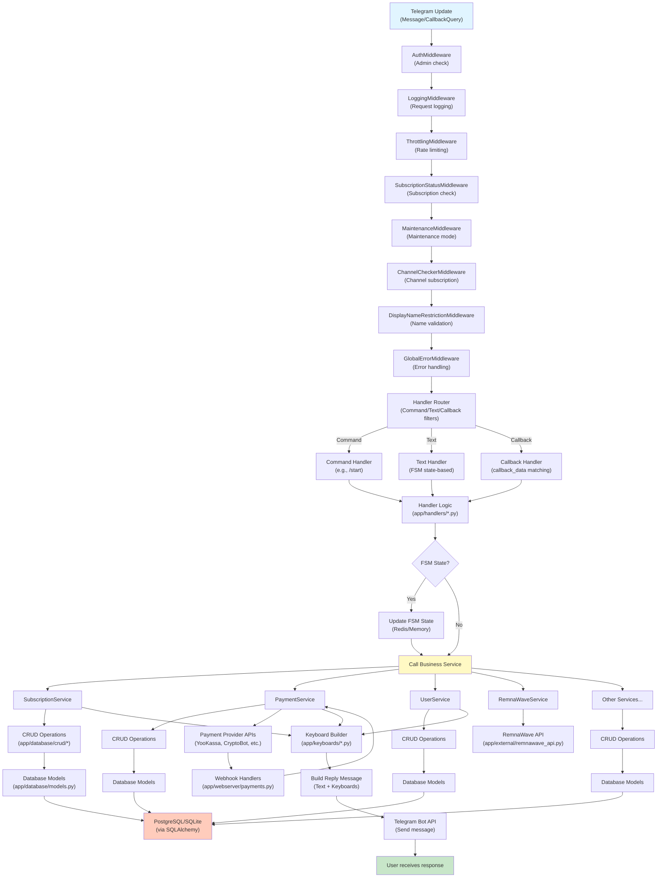

# Telegram Bot Flows Overview

This document provides a high-level, **feature-centric** map of how the Telegram bot (aiogram) handles
user and admin interactions. It connects:

- Incoming updates (commands, text, buttons)
- aiogram middlewares and handlers
- Business services
- Database and external APIs
- Outgoing replies and keyboards

It serves as an entry point into the more detailed maps:

- `docs/telegram-keyboards-map.md` — button & keyboard centric view
- `docs/telegram-fsm-flows.md` — FSM/state centric view
- `docs/telegram-feature-flows.md` — end‑to‑end feature flows

---

## Layers & Global Request Flow

The bot uses a layered architecture (Handlers → Services → Database/External APIs).

### Complete Request Flow Diagram

### Key Directories (Telegram-related)

- `app/bot.py` – bot & dispatcher setup, handler registration, middleware wiring.
- `app/states.py` – FSM state classes for registration, subscription, balance, admin flows, etc.
- `app/handlers/` – user, admin, subscription, balance, support, ticket and webhook handlers.
- `app/keyboards/` – reply, inline and admin keyboards.
- `app/services/` – business logic services (subscription, payments, users, referrals, etc.).
- `app/database/` – SQLAlchemy models and CRUD helpers.
- `app/external/` – payment providers and RemnaWave integration.

---

## Feature Buckets (Top-Level)

All bot capabilities can be grouped into the following **feature buckets**.
Each bucket will be detailed in `docs/telegram-feature-flows.md`.

- **Registration & Onboarding**
  - `/start` flow, language selection, first subscription state.
- **Main Menu & Navigation**
  - Main reply keyboard for users, navigation to other features.
- **Subscription Purchase & Management**
  - Subscription purchase wizard (countries, devices, traffic, period, autopay).
  - Subscription settings updates, trial activation, renewals.
- **Balance & Payments**
  - Balance top-up, multiple payment providers (YooKassa, CryptoBot, Heleket, MulenPay, Pal24, Stars, etc.).
- **Support & Tickets**
  - Contact support, create and manage tickets (user and admin sides).
- **Referral Program**
  - Referral link generation, referral stats and rewards.
- **Admin Panel**
  - All admin‑only flows (users, subscriptions, promo, campaigns, monitoring, servers, pricing, rules, reports, logs, etc.).

Each of these buckets will have:

- Trigger map (commands and buttons).
- FSM map (if applicable).
- Handler & service dependencies.
- External systems involved.

---

## FSM & State Usage – Overview

FSM state classes are defined in `app/states.py` and used throughout handlers
to model multi‑step flows (registration, subscription purchase, admin wizards, etc.).

Details per state class and per feature are documented in:

- `docs/telegram-fsm-flows.md` – state machine diagrams and handler mappings.

---

## How to Use These Docs

- Start here to locate **which feature bucket** a change belongs to.
- Jump to:
  - `docs/telegram-keyboards-map.md` to find which button triggers which handler/feature.
  - `docs/telegram-fsm-flows.md` to see which states and steps are involved.
  - `docs/telegram-feature-flows.md` to understand end‑to‑end data & service dependencies.

Keeping these documents in sync with code helps avoid **hidden couplings** and
reduces the risk of introducing technical debt when adding or modifying features.
