# Telegram FSM (State Machine) Flows

This document provides a **state‑centric** view of the bot:

- FSM state classes defined in `app/states.py`.
- States used in user flows (registration, subscription, balance, support, etc.).
- States used in admin flows (backups, maintenance, support settings, etc.).
- Links from states to handlers and feature buckets.

Detailed per‑feature flows and dependencies are in:

- `docs/telegram-feature-flows.md`

---

## 1. FSM State Classes Overview (`app/states.py`)

All state classes defined in `app/states.py`:

- `RegistrationStates` - User registration and onboarding flow
- `SubscriptionStates` - Subscription purchase and management
- `BalanceStates` - Balance top-up and payment flows
- `PromoCodeStates` - Promo code activation
- `AdminStates` - Admin panel workflows (extensive)
- `SupportStates` - Support message handling
- `TicketStates` - User ticket creation and management
- `AdminTicketStates` - Admin ticket management
- `SupportSettingsStates` - Support settings configuration
- `BotConfigStates` - Bot configuration management
- `PricingStates` - Pricing configuration
- `AutoPayStates` - Auto-pay configuration
- `SquadCreateStates` - Squad/server creation
- `SquadRenameStates` - Squad renaming
- `SquadMigrationStates` - Squad migration between servers
- `RemnaWaveSyncStates` - RemnaWave synchronization
- `AdminSubmenuStates` - Admin submenu navigation tracking

### 1.1. RegistrationStates

| State Name                      | Handler Module(s)                    | Typical Trigger (button/command)                    | Feature Bucket            |
|---------------------------------|--------------------------------------|-----------------------------------------------------|---------------------------|
| `waiting_for_language`          | `app/handlers/start.py`              | `/start`, `language_select:*` callback              | Registration & Onboarding|
| `waiting_for_rules_accept`      | `app/handlers/start.py`              | `rules_accept`, `rules_decline` callbacks           | Registration & Onboarding|
| `waiting_for_privacy_policy_accept` | `app/handlers/start.py`          | `privacy_policy_accept`, `privacy_policy_decline`   | Registration & Onboarding|
| `waiting_for_referral_code`     | `app/handlers/start.py`              | Text input, `referral_skip` callback                | Registration & Onboarding|

**Keyboards used:**
- `get_language_selection_keyboard()` - inline
- `get_rules_keyboard()` - inline
- `get_privacy_policy_keyboard()` - inline
- `get_skip_keyboard()` - reply
- `get_post_registration_keyboard()` - inline

### 1.2. SubscriptionStates

| State Name                      | Handler Module(s)                    | Typical Trigger (button/command)                    | Feature Bucket                  |
|---------------------------------|--------------------------------------|-----------------------------------------------------|--------------------------------|
| `selecting_period`              | `app/handlers/subscription/purchase.py` | `period_*` callback, `menu_buy` callback          | Subscription Purchase & Manage |
| `selecting_traffic`              | `app/handlers/subscription/purchase.py` | `traffic_*` callback                               | Subscription Purchase & Manage |
| `selecting_countries`            | `app/handlers/subscription/countries.py` | Country selection callbacks                        | Subscription Purchase & Manage |
| `selecting_devices`              | `app/handlers/subscription/devices.py` | `devices_*` callback                               | Subscription Purchase & Manage |
| `confirming_purchase`            | `app/handlers/subscription/purchase.py` | `subscription_confirm` callback                     | Subscription Purchase & Manage |
| `adding_countries`               | `app/handlers/subscription/countries.py` | `subscription_add_countries` callback               | Subscription Purchase & Manage |
| `adding_traffic`                 | `app/handlers/subscription/traffic.py` | Traffic addition flows                              | Subscription Purchase & Manage |
| `adding_devices`                 | `app/handlers/subscription/devices.py` | `add_devices_*` callback                            | Subscription Purchase & Manage |
| `extending_subscription`          | `app/handlers/subscription/purchase.py` | `extend_period_*` callback                          | Subscription Purchase & Manage |
| `confirming_traffic_reset`       | `app/handlers/subscription/purchase.py` | `confirm_reset_traffic` callback                     | Subscription Purchase & Manage |
| `cart_saved_for_topup`           | `app/handlers/subscription/purchase.py` | Cart save flows                                    | Subscription Purchase & Manage |
| `waiting_for_simple_subscription_payment_method` | `app/handlers/simple_subscription.py` | `simple_subscription_*` callbacks                  | Subscription Purchase & Manage |

**Keyboards used:**
- `get_subscription_keyboard()` - inline
- `get_subscription_period_keyboard()` - inline
- `get_traffic_packages_keyboard()` - inline
- `get_countries_keyboard()` - inline
- `get_devices_keyboard()` - inline
- `get_subscription_confirm_keyboard()` - inline

### 1.3. BalanceStates

| State Name                      | Handler Module(s)                    | Typical Trigger (button/command)                    | Feature Bucket            |
|---------------------------------|--------------------------------------|-----------------------------------------------------|---------------------------|
| `waiting_for_amount`            | `app/handlers/balance/main.py`       | Text input, `quick_amount_*` callback              | Balance & Payments       |
| `waiting_for_pal24_method`      | `app/handlers/balance/pal24.py`      | Pal24 payment method selection                      | Balance & Payments       |
| `waiting_for_platega_method`    | `app/handlers/balance/platega.py`    | Platega payment method selection                    | Balance & Payments       |
| `waiting_for_stars_payment`     | `app/handlers/stars_payments.py`     | Telegram Stars payment flow                         | Balance & Payments       |
| `waiting_for_support_request`    | `app/handlers/balance/*`             | Support-related balance flows                       | Balance & Payments       |
| `waiting_for_card_to_card_receipt` | `app/handlers/balance/*`          | Card-to-card payment receipt upload                 | Balance & Payments       |

**Keyboards used:**
- `get_balance_keyboard()` - inline
- `get_payment_methods_keyboard()` - inline
- `get_yookassa_payment_keyboard()` - inline
- `get_cryptobot_payment_keyboard()` - inline

### 1.4. PromoCodeStates

| State Name                      | Handler Module(s)                    | Typical Trigger (button/command)                    | Feature Bucket            |
|---------------------------------|--------------------------------------|-----------------------------------------------------|---------------------------|
| `waiting_for_code`              | `app/handlers/promocode.py`          | Text input (promo code)                              | Promo Code Activation     |
| `waiting_for_referral_code`     | `app/handlers/promocode.py`          | Text input (referral code)                           | Promo Code Activation     |

### 1.5. AdminStates

This is the largest state class with 100+ states covering all admin workflows. Major categories:

**User Management:**
- `waiting_for_user_search`
- `sending_user_message`
- `editing_user_balance`
- `extending_subscription`
- `adding_traffic`
- `granting_subscription`
- `editing_user_subscription`
- `editing_user_devices`
- `editing_user_traffic`
- `editing_user_referrals`
- `editing_user_referral_percent`

**Promo Code Management:**
- `creating_promocode`
- `setting_promocode_type`
- `setting_promocode_value`
- `setting_promocode_uses`
- `setting_promocode_expiry`
- `selecting_promo_group`

**Campaign Management:**
- `creating_campaign_name`
- `creating_campaign_start`
- `creating_campaign_bonus`
- `creating_campaign_balance`
- `creating_campaign_subscription_days`
- `creating_campaign_subscription_traffic`
- `creating_campaign_subscription_devices`
- `creating_campaign_subscription_servers`
- `editing_campaign_*` (multiple states)

**Broadcast Management:**
- `waiting_for_broadcast_message`
- `waiting_for_broadcast_media`
- `confirming_broadcast`

**Promo Group Management:**
- `creating_promo_group_name`
- `creating_promo_group_priority`
- `creating_promo_group_traffic_discount`
- `creating_promo_group_server_discount`
- `creating_promo_group_device_discount`
- `creating_promo_group_period_discount`
- `creating_promo_group_auto_assign`
- `editing_promo_group_*` (multiple states)

**Pricing & Server Management:**
- `editing_squad_price`
- `editing_traffic_price`
- `editing_device_price`
- `editing_server_name`
- `editing_server_price`
- `editing_server_country`
- `editing_server_limit`
- `editing_server_description`
- `editing_server_promo_groups`
- `creating_server_*` (multiple states)

**Content Management:**
- `editing_rules_page`
- `editing_privacy_policy`
- `editing_public_offer`
- `creating_faq_title`
- `creating_faq_content`
- `editing_faq_*` (multiple states)
- `editing_notification_value`
- `editing_welcome_text`
- `waiting_for_message_buttons`

**Promo Offer Management:**
- `editing_promo_offer_message`
- `editing_promo_offer_button`
- `editing_promo_offer_valid_hours`
- `editing_promo_offer_active_duration`
- `editing_promo_offer_discount`
- `editing_promo_offer_test_duration`
- `editing_promo_offer_squads`
- `selecting_promo_offer_user`
- `searching_promo_offer_user`

**Navigation Tracking:**
- `viewing_user_from_balance_list`
- `viewing_user_from_traffic_list`
- `viewing_user_from_last_activity_list`
- `viewing_user_from_spending_list`
- `viewing_user_from_purchases_list`
- `viewing_user_from_campaign_list`

**Other:**
- `confirming_sync`
- `waiting_for_bot_name`
- `waiting_for_bot_token`

**Handler Modules:** All `app/handlers/admin/*.py` modules use these states.

### 1.6. SupportStates

| State Name                      | Handler Module(s)                    | Typical Trigger (button/command)                    | Feature Bucket            |
|---------------------------------|--------------------------------------|-----------------------------------------------------|---------------------------|
| `waiting_for_message`           | `app/handlers/support.py`            | Support message input                               | Support & Tickets         |

### 1.7. TicketStates

| State Name                      | Handler Module(s)                    | Typical Trigger (button/command)                    | Feature Bucket            |
|---------------------------------|--------------------------------------|-----------------------------------------------------|---------------------------|
| `waiting_for_title`             | `app/handlers/tickets.py`            | Ticket title input                                   | Support & Tickets         |
| `waiting_for_message`           | `app/handlers/tickets.py`            | Ticket message input                                 | Support & Tickets         |
| `waiting_for_reply`              | `app/handlers/tickets.py`            | Ticket reply input                                   | Support & Tickets         |

**Keyboards used:**
- `get_support_keyboard()` - inline
- `get_ticket_cancel_keyboard()` - inline
- `get_my_tickets_keyboard()` - inline
- `get_ticket_view_keyboard()` - inline

### 1.8. AdminTicketStates

| State Name                      | Handler Module(s)                    | Typical Trigger (button/command)                    | Feature Bucket            |
|---------------------------------|--------------------------------------|-----------------------------------------------------|---------------------------|
| `waiting_for_reply`              | `app/handlers/admin/tickets.py`      | Admin ticket reply input                             | Admin/Support             |
| `waiting_for_block_duration`    | `app/handlers/admin/tickets.py`      | User block duration input                            | Admin/Support             |

### 1.9. SupportSettingsStates

| State Name                      | Handler Module(s)                    | Typical Trigger (button/command)                    | Feature Bucket            |
|---------------------------------|--------------------------------------|-----------------------------------------------------|---------------------------|
| `waiting_for_desc`               | `app/handlers/admin/support_settings.py` | Support description input                        | Admin/Support             |

### 1.10. BotConfigStates

| State Name                      | Handler Module(s)                    | Typical Trigger (button/command)                    | Feature Bucket            |
|---------------------------------|--------------------------------------|-----------------------------------------------------|---------------------------|
| `waiting_for_value`              | `app/handlers/admin/bot_configuration.py` | Config value input                              | Admin/Settings            |
| `waiting_for_search_query`       | `app/handlers/admin/bot_configuration.py` | Config search query input                        | Admin/Settings            |
| `waiting_for_import_file`        | `app/handlers/admin/bot_configuration.py` | Config import file upload                         | Admin/Settings            |

### 1.11. PricingStates

| State Name                      | Handler Module(s)                    | Typical Trigger (button/command)                    | Feature Bucket            |
|---------------------------------|--------------------------------------|-----------------------------------------------------|---------------------------|
| `waiting_for_value`              | `app/handlers/admin/pricing.py`      | Pricing value input                                  | Admin/Pricing             |

### 1.12. AutoPayStates

| State Name                      | Handler Module(s)                    | Typical Trigger (button/command)                    | Feature Bucket            |
|---------------------------------|--------------------------------------|-----------------------------------------------------|---------------------------|
| `setting_autopay_days`          | `app/handlers/subscription/autopay.py` | `autopay_set_days` callback                      | Subscription Purchase & Manage |
| `confirming_autopay_toggle`     | `app/handlers/subscription/autopay.py` | `autopay_enable`, `autopay_disable` callbacks   | Subscription Purchase & Manage |

### 1.13. SquadCreateStates

| State Name                      | Handler Module(s)                    | Typical Trigger (button/command)                    | Feature Bucket            |
|---------------------------------|--------------------------------------|-----------------------------------------------------|---------------------------|
| `waiting_for_name`              | `app/handlers/admin/remnawave.py`     | Squad name input                                     | Admin/RemnaWave           |
| `selecting_inbounds`             | `app/handlers/admin/remnawave.py`    | Inbound selection                                    | Admin/RemnaWave           |

### 1.14. SquadRenameStates

| State Name                      | Handler Module(s)                    | Typical Trigger (button/command)                    | Feature Bucket            |
|---------------------------------|--------------------------------------|-----------------------------------------------------|---------------------------|
| `waiting_for_new_name`          | `app/handlers/admin/remnawave.py`    | New squad name input                                 | Admin/RemnaWave           |

### 1.15. SquadMigrationStates

| State Name                      | Handler Module(s)                    | Typical Trigger (button/command)                    | Feature Bucket            |
|---------------------------------|--------------------------------------|-----------------------------------------------------|---------------------------|
| `selecting_source`              | `app/handlers/admin/remnawave.py`    | Source squad selection                               | Admin/RemnaWave           |
| `selecting_target`              | `app/handlers/admin/remnawave.py`    | Target squad selection                               | Admin/RemnaWave           |
| `confirming`                    | `app/handlers/admin/remnawave.py`    | Migration confirmation                               | Admin/RemnaWave           |

### 1.16. RemnaWaveSyncStates

| State Name                      | Handler Module(s)                    | Typical Trigger (button/command)                    | Feature Bucket            |
|---------------------------------|--------------------------------------|-----------------------------------------------------|---------------------------|
| `waiting_for_schedule`          | `app/handlers/admin/remnawave.py`    | Sync schedule input                                  | Admin/RemnaWave           |

### 1.17. AdminSubmenuStates

| State Name                      | Handler Module(s)                    | Typical Trigger (button/command)                    | Feature Bucket            |
|---------------------------------|--------------------------------------|-----------------------------------------------------|---------------------------|
| `in_users_submenu`              | `app/handlers/admin/users.py`       | Admin users submenu navigation                      | Admin/Users               |
| `in_promo_submenu`              | `app/handlers/admin/promo_groups.py` | Admin promo submenu navigation                      | Admin/Promo               |
| `in_communications_submenu`      | `app/handlers/admin/messages.py`     | Admin communications submenu navigation              | Admin/Communications      |
| `in_settings_submenu`           | `app/handlers/admin/bot_configuration.py` | Admin settings submenu navigation            | Admin/Settings            |
| `in_system_submenu`             | `app/handlers/admin/*`               | Admin system submenu navigation                      | Admin/System              |

---

## 2. Registration Flow (Complete FSM)

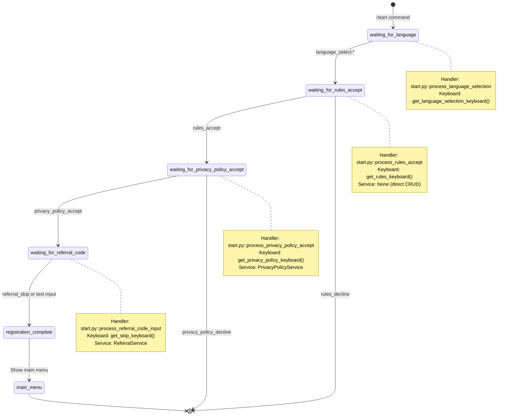

**Key Components:**

- Entry point handler: `app/handlers/start.py::cmd_start`
- Keyboards:
  - `get_language_selection_keyboard()` (inline)
  - `get_rules_keyboard()` (inline)
  - `get_privacy_policy_keyboard()` (inline)
  - `get_skip_keyboard()` (reply)
  - `get_main_reply_keyboard()` (reply)
- Services:
  - `UserService` - creates/updates user
  - `PrivacyPolicyService` - handles privacy policy acceptance
  - `ReferralService` - processes referral codes
  - `SubscriptionService` - may create initial subscription
  - `TrialActivationService` - may activate trial
  - `RemnaWaveService` - syncs user with RemnaWave API

---

## 3. Subscription Purchase Flow (Complete FSM)

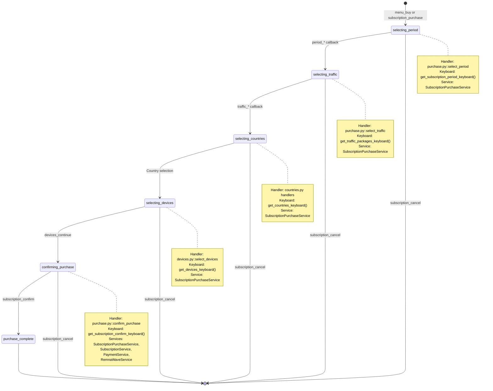

**Alternative Flows:**

### 3.1. Subscription Management (Existing Subscription)

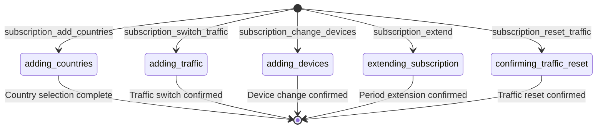

### 3.2. Auto-pay Configuration

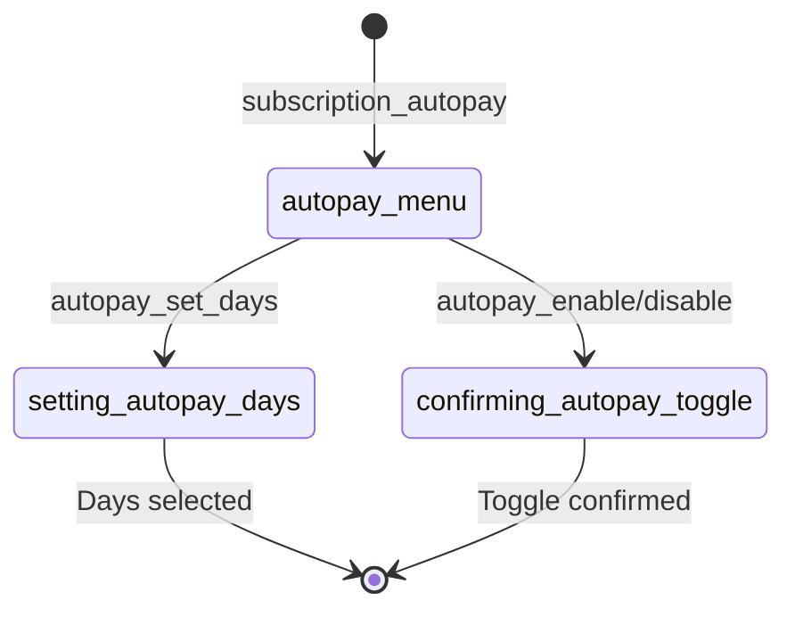

**Handlers and Modules:**

- `app/handlers/subscription/purchase.py` - main purchase flow
- `app/handlers/subscription/countries.py` - country selection
- `app/handlers/subscription/devices.py` - device selection
- `app/handlers/subscription/traffic.py` - traffic selection
- `app/handlers/subscription/pricing.py` - pricing calculations
- `app/handlers/subscription/autopay.py` - auto-pay configuration

**Services:**

- `SubscriptionPurchaseService` - builds purchase options, calculates pricing
- `SubscriptionService` - creates/updates subscriptions, syncs with RemnaWave
- `PaymentService` - handles payment processing
- `UserCartService` - manages cart persistence in Redis
- `RemnaWaveService` - syncs subscription with RemnaWave API

---

## 4. Balance & Payment Flows

### 4.1. Balance Top-Up Flow

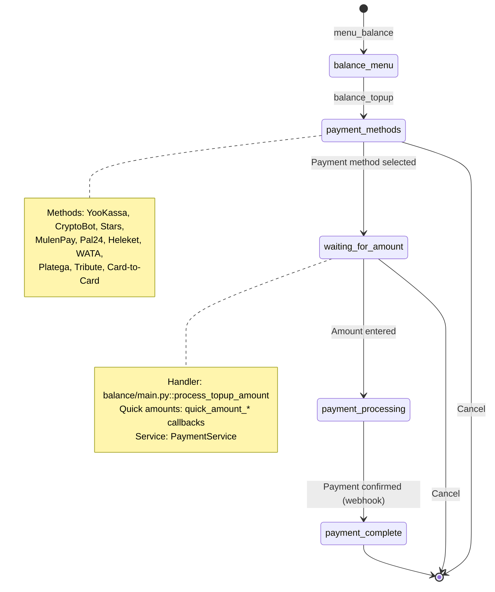

### 4.2. Payment Provider-Specific States

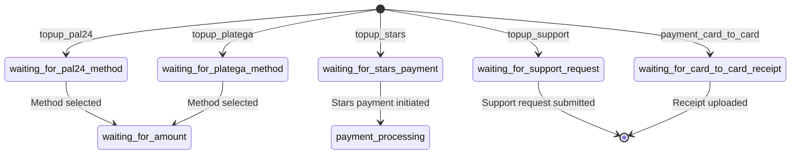

## 5. Support & Ticket Flows

### 5.1. User Ticket Creation

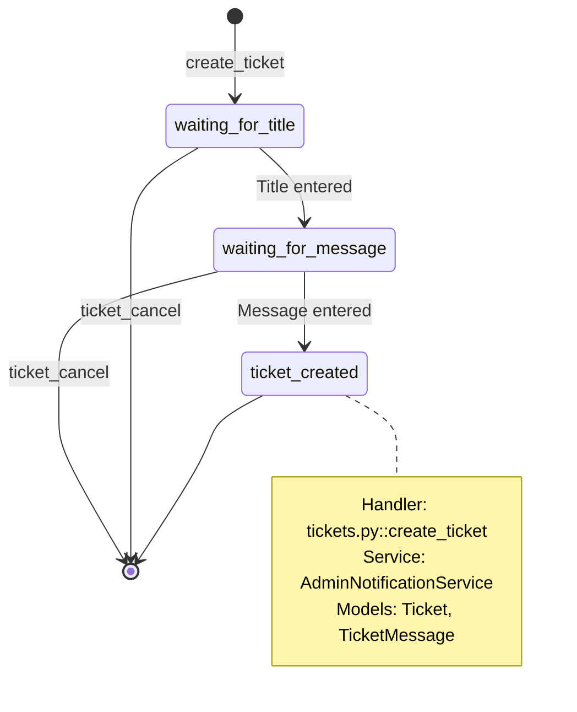

### 5.2. Ticket Reply Flow

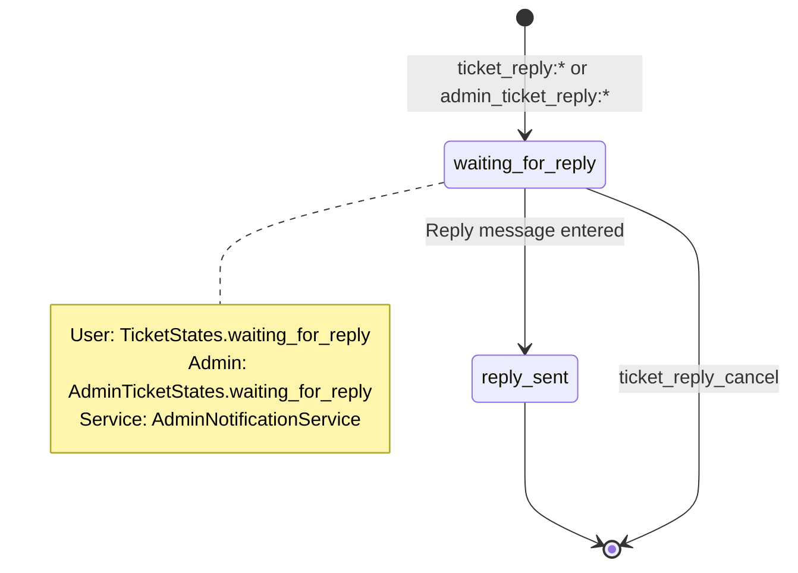

## 6. Admin FSM Flows (Selected Major Flows)

### 6.1. Admin Promo Code Creation

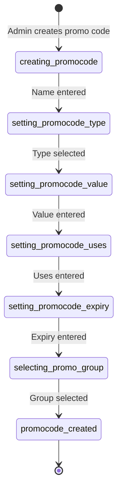

### 6.2. Admin Broadcast Flow

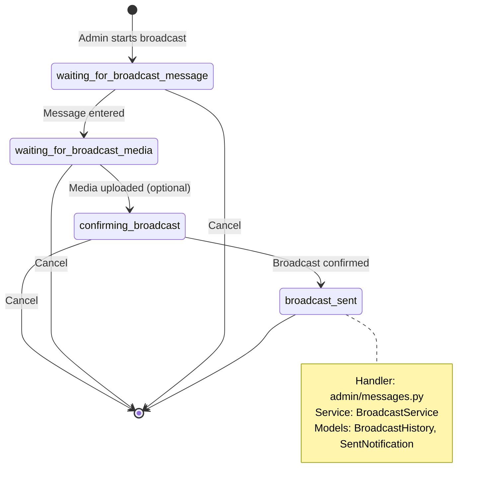

### 6.3. Admin Promo Group Creation

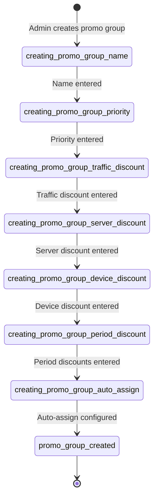

**Note:** Admin flows are extensive. See `app/states.py::AdminStates` for complete list of 100+ admin states covering:
- User management
- Subscription management
- Promo code/group/offer management
- Campaign management
- Server/squad management
- Pricing configuration
- Content management (FAQ, rules, privacy policy, etc.)
- Monitoring and reporting
- System configuration
